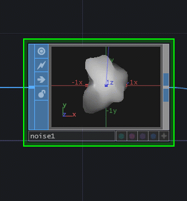
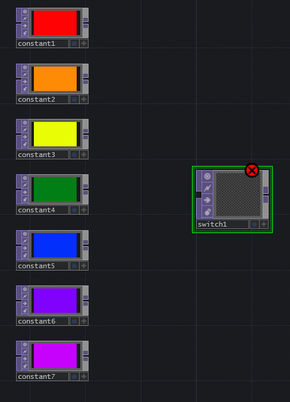
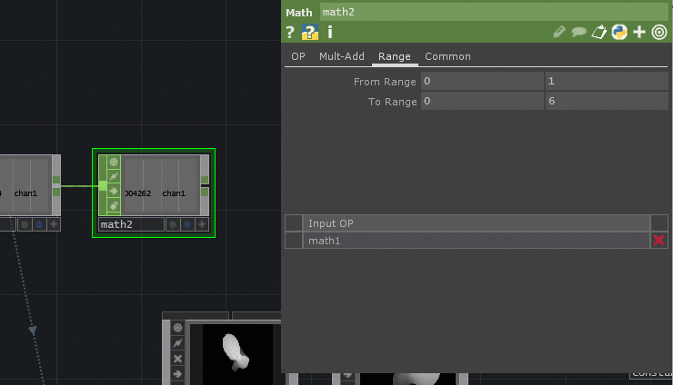
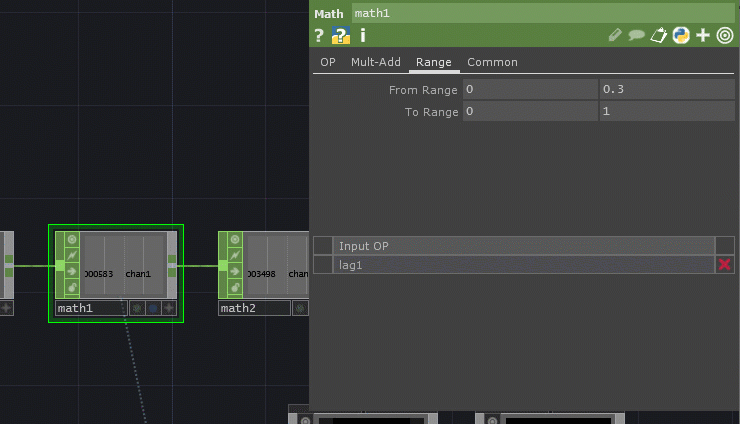
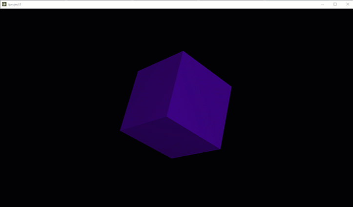
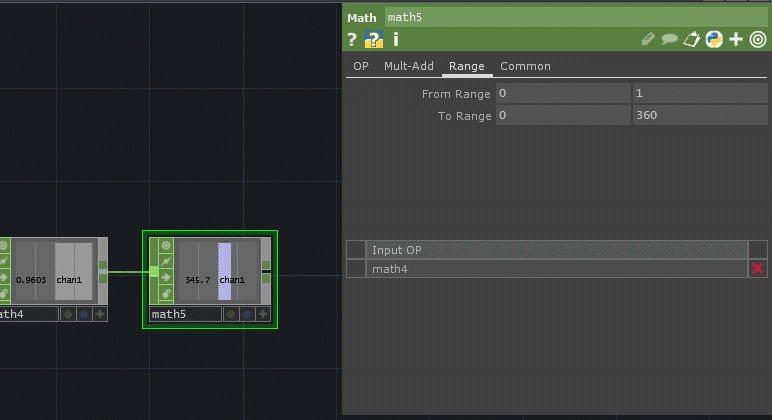
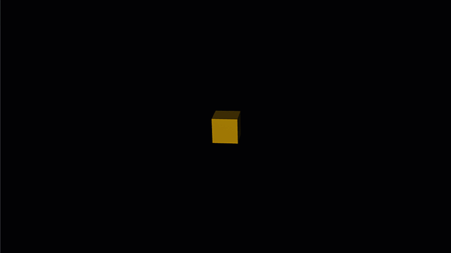

# Audio-Reactive 3D Shapes

This activity uses TouchDesigner. Please see the TouchDesigner section at the end of the menu on the left for more information about the program.


New TouchDesigner projects open with an example project. Please highlight and delete those operators so the project is empty.


## Goal

The goal of this activity is to have audio from a microphone or an audio file effect the shape and color of a 3D object.

## Step 1: 3D Shape Set Up

For 3D shapes, we need the following:

* a light
* a camera
* a shape/geometry
* a way to render it flat

The first two are Component operators or COMPs.

Press the TAB key or right-click and select **Add Operator** to bring up the OP Create Dialog. Go to the COMP tab. Search for and select the Light COMP.

Click to place.

Do the same with a Camera COMP.

For the Geometry, it's easier to start with your shape, found in the blue surface operators or SOPs.

Bring up the OP Create Dialog and select the SOP tab. Search for and select the Sphere SOP.

Click to place.

Right-click on the output of the Sphere SOP and select **Add Operator**. Click the black COMP tab. Search for and select the Geometry COMP.

This makes it so blue surface operators \(SOPs\) can connect to the Geometry COMP.

Lastly, bring up the OP Create Dialog and click on the purple texture operator \(TOP\) tab. Search for and select the Render TOP.

This automatically finds and brings in the COMPs to create a flat scene to display.

To have this appear easily in a separate window, let's use a Null and Out texture operator \(TOP\).

A **Null** operator is like a snapshot of progress.

Right-click on the Render TOP output and add a Null TOP.

The project is looking for a texture operator named "out1" by default to display. Add this by right-clicking on the output of the Null TOP and add an Out TOP.

Now, you can preview what this looks like by clicking the **Open Viewer** button at the top left \(looks like a square\).

## Step 2: Add Some Noise \(Randomness\)

Texture, surface, and channel tops all have random operators named "Noise."

Move the Sphere SOP a little to the left to make room.

Right-click on the connected line and select **Insert Operator**. Under the blue SOP options, search and select the Noise SOP.

Click to place.

You should now have a moving blob.

Play with the parameters to see the effects.

## Step 3: Bring in Some Audio

For Audio, we will use channel operators or CHOPs.

To bring data in from a microphone, add an Audio Device In CHOP.

Make some noise! The red waveform is the audio the microphone is picking up.

To turn this into something that can be used as values, right-click on the output of the Audio Device In CHOP and add an Analyze CHOP.

The default function is Average, but I've noticed the best values come from the RMS Power function.

The values seem to go from just above 0 to 0.3.

Let's look at the Noise SOP and see what we want to change and what the value range needs to be.

I like the effect the Roughness parameter gives as it goes from 0 to 1.

Let's "map" or change the range of our Analyze CHOP to be 0 to 1 instead by adding a Math CHOP.

Right-click on the output of the Analyze CHOP to add a Math CHOP.

Select the Math CHOP. Select the Range tab in the parameters.

Have the range go from 0 to 0.3 and 0 to 1.

## Step 4: Reference the Audio Data

Now, we want the Roughness to reference the Math CHOP.

Click the "Viewer Active" toggle on the bottom right of the operator to make the operator appear to change when you hover over it.

Select the Noise SOP to bring up its parameters.

Click and drag the Math TOP operator to the value for Roughness and let go. Select **CHOP Reference**.

This will put the Python expression that references the Math CHOP operator and the channel named "chan1".

You should now be able to see a change in the blob as you make noises!

## Step 5: Add Some Color

One of my favorite ways to add a color is to create a "rainbow switch" using texture operators \(TOPs\) and overlaying the changing color over the flattened shape.

Create a set of colors using Constant TOPs near the right side/purple end of the network.

Start by adding one Constant TOP.

Bump up the resolution to match the screen or current resolution under the Common tab.

Copy \(CTRL+C or right-click and select Copy\) and Paste \(CTRL+V or right-click and select Paste\) six times.

For each, select a different color under the Constant tab. 

I generally choose colors in the order of the rainbow - an intuitive order many are familiar with.

Add a standalone Switch TOP. A **Switch** operator is like a selector that selects from an array or list of connected operators. The cool thing about a Switch TOP is that it can blend two operators.

Right-click and drag to select the Constant TOPs. Left-click and drag from the output of one of the Constant TOPs to the input of the Switch TOP. This will connect all the selected TOPs.

Click on the Switch TOP to bring up its parameters. Move the Index slider to see how it goes through the connected TOPs.

Turn on **Blend between Inputs** and see how it has a blend between each color.

Add a standalone Composite TOP.

Connect the Switch TOP and the Null TOP to the input of the Composite TOP. This will add the color.

Right-click on the output of the Composite TOP and add a Null TOP as a snapshot.

Connect this new Null TOP \("null2"\) to the Out TOP \(replacing the line\).

## Step 6: Connect the Audio Data to the Color

Since we have a Math CHOP already normalizing the range from 0 to 1, add another Math CHOP just for the color with the range "mapped" from 0 to 1 to 0 to 6.

This 0 to 6 range will control the index value of the Switch TOP.

Click the "Viewer Active" toggle on the bottom right of the "math2" operator to make the operator appear to change when you hover over it.

Select the Switch TOP to bring up its parameters.

Click and drag the "math2" operator to the value for Index and let go. Select **CHOP Reference**.

This will put the Python expression that references the Math CHOP operator and the channel named "chan1".

## Step 7: Smooth It Out

With Audio, you'll notice the changes can be jumpy - this has something to do with the way the audio data comes through with quick drops to zero and back.

To smooth this out, add a Lag CHOP before the first Math CHOP. Insert the Lag CHOP by right-clicking between the Analyze CHOP and "math1" and selecting **Insert Operator**.

This defaults to 0.2 seconds and is pretty good at that value, but play around with it to get the effect you want.

## Step 8: Try Moving a Cube

Instead of a sphere, let's try a cube.

Create a standalone Box SOP near the Sphere SOP.

Right-click on the output of the Box SOP and add a Transform SOP so we can use audio to move the cube around.

Using the click-and-drag method as before, reference the values of the "math1" operator for all three axes of the Scale parameter of the Transform SOP.

For rotation, let's add a third Math CHOP that takes the "math1" data and "maps" it or re-ranges it from 0-180. The easiest way is to add a standalone Math CHOP and left-click and drag from the output of "math1" to the input of the new Math CHOP \("math3"\).

Reference the channel "chan1" in the operator "math3" using the click-and-drag method or by typing the expression in for all three axes of the Transform SOP.

Now, connect the Transform SOP to the Geometry COMP, replacing the current connection.

## Step 9: Try It with an Audio File

Add an Audio File In CHOP and update the file to have a song or a video of a song.

You can't hear anything until you add and connect an Audio Device Out CHOP that uses your speakers.

Connect the Audio File In CHOP to the Analyze CHOP, replacing the current connection.

The new audio may be different for you, but mine has a higher range than my microphone. I will update the range in "math1" to reflect this.

This is a GIF of a possible result:

This looks OK, but can be better.

## Step 10: Add a Little Extra

Let's add an LFO \(low-frequency oscillator\) to add some rhythm and adjust the amount of possible rotation.

Add a standalone LFO CHOP and turn the frequency down to 0.15.

We want to normalize this to 0 to 1, but instead of range, let's just make the values positive with a Math CHOP.

Right-click on the output of the LFO CHOP and add a Math CHOP.

Change the Channel Pre OP to **Positive**.

Now, add another Math CHOP to change the range to 0 to 360.

In the "math3" operator controlling the rotation, reference the "math4" operator as the upper bound of the new range.

Now, the movement seems a little more rhythmic.

