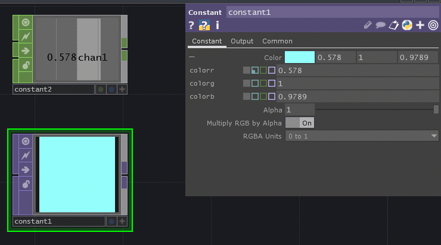
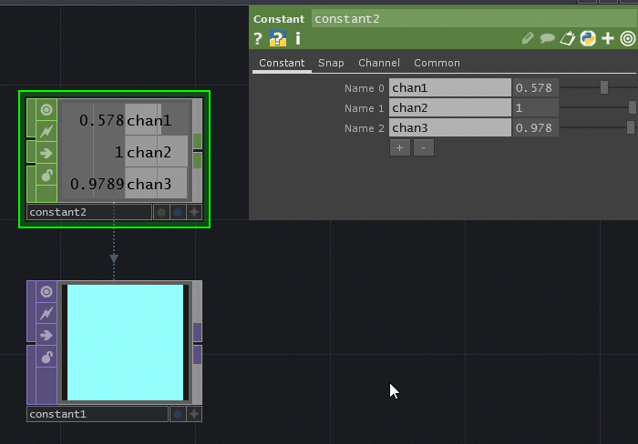
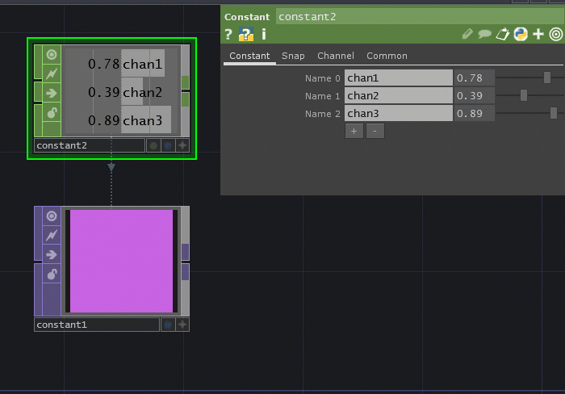
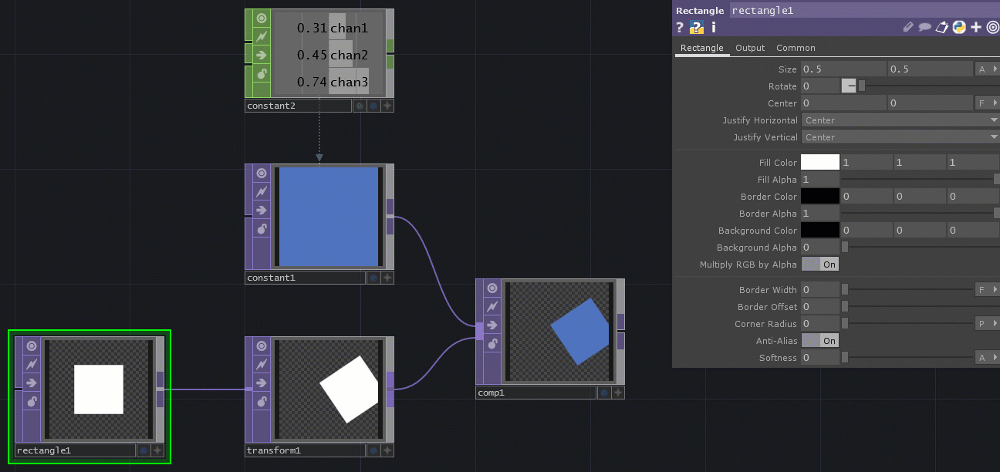

# TouchDesigner Activity Notes

The activity we did was to get you practicing a little more with adding operators (nodes) in TouchDesigner, especially Transform and Constant operators. We also touched on referencing Channel Operators (CHOPs).

In TouchDesigner, clear out/delete the default project.

## **Step 1: Add a 2D Primative (Shape)**

We are using 2D (or "flat") shapes, so we will be using the purple Texture operators (TOPs).

The two shapes to play with would be a Circle TOP or Rectangle TOP.

Bring up the **OP Create Dialog** that shows all the available operators by pressing the Tab button OR right-click and select **Add Operator**.

.png>)

You can use the search bar at the top left or look around and find the Circle TOP or the Rectangle TOP.

I'll use a Rectangle TOP here.

Once selected, click again to place the operator.

.png>)

When you select the operator, it should show you its parameters (properties) on the top right. If you do not see these, press the P key to toggle it on and off.

## **Step 2: Add a Transform TOP**

Although you can update the parameters of the original Rectangle TOP, it's sometimes better to add an operator that changes the shape instead - this way, you can use the same root or seed shape to create multiple types.

Just like in Unity, the component/operator that controls the position and size is called **Transform**. We need to stay in the same color to link the nodes, so we will use a purple Transform TOP.

Bring up the **OP Create Dialog** by pressing the Tab button OR right-click and select **Add Operator**.

You can use the search bar at the top left or look around and find the Transform TOP.

Once selected, click again to place the operator.

At first, if it's not linked, the Transform TOP will give you an error because it doesn't know WHAT to move or resize.

.png>)

Click and drag from the "output" notch on the right of the Rectangle TOP to the "input" notch on the left of the Transform TOP. Once connected, you can see the display of the Transform TOP showing its effect. By default, there is no effect.

.png>)

Select and update the Transform TOP's parameters to see a result:

.png>)

.png>)

## Step 3: Creating a Color

Let's put our shapes to the side for now.

Just like in Unity or when coding in Processing, color is seen as separate from the shape/object.

Color is considered a "flat" visual object in TouchDesigner, so we are staying with the purple Texture operators (TOPs).

For "just a single color," we want to use a **Constant** **TOP**. 

Bring up the **OP Create Dialog** by pressing the Tab button OR right-click and select **Add Operator**.

You can use the search bar at the top left or look around and find the Constant TOP.

Once selected, click again to place the operator.

.png>)

You can easily change the color by clicking on the white rectangle and using sliders to select the color you want.

.png>)

Notice the numbers uses in Red, Green, and Blue here fall between 0 and 1.

Close the Color box to save and return to TouchDesigner.

Those numbers appear in the values next to the color.

.png>)

## Step 4: Creating a Number

Just like a color, we can create a number. It can also be a **Constant**, but this time, because it uses a NUMBER, it will be a green Channel operator (CHOP).

Bring up the **OP Create Dialog** by pressing the Tab button OR right-click and select **Add Operator**.

Click on the green CHOP tab.

.png>)

You can use the search bar at the top left or look around and find the Constant CHOP

Once selected, click again to place the operator.

.png>)

If you use the slider, you'll notice that the number is a floating point number that goes from 0 to 1. (Note: you can always type in a higher or negative number.)

You can rename the channel like we did in class, but I'll leave it as "chan1" here.

The red value of my current color is 0.578, so I'll type that in for my Constant CHOP.

.png>)

## Step 5: Referencing a CHOP Value

We cannot directly link a green channel operator (CHOP) to a purple texture operator (TOP), but we can **reference **the CHOP values.

First, let's look at our Constant TOP (color) and its values.

By default, the parameters are "collapsed" to make it look pretty. We can click the **+** (plus sign) to the left of a parameter to see the actual names of the properties (similar to variables).

.png>)

Here, we see the three floating point values are **colorr**, **colorg**, and **colorb**.

Next to each are 4 colored squares -

* **Gray:** Values you type in directly
* **Cyan:** Values from referencing a CHOP that changes OR a script reference
* **Green: **Values from an exported CHOP, not constantly updating
* **Lavender:** Bind? Not sure exactly what this means. Don't worry about this one.

Right now, they are all gray because we chose these values directly through choosing a color.

To reference our Constant CHOP, we can do two different methods:

### First way: Script Reference

You can type the name of the operator and the channel to get the value.

Use this template:

`op('name_of_operator')['name_of_channel']`

So for our example, it's:

`op('constant2')['chan1']`

.png>)

Notice that the number we have for constant2, our Constant CHOP is now showing in the first value next to the Color parameter and is colored cyan.

### Second Way: Click and Drag from CHOP

If you don't want to remember the script reference, there is a click-and-drag option.

On your Constant CHOP, there is a small plus sign **+** button on the bottom left of the operator. Click it to toggle "Viewer Active" mode.

Default mode:

.png>)

Viewer active mode:

.png>)

It should turn green when you hover your cursor over it and your cursor should turn into a chevron.

Click on your Constant TOP (color) to bring up its properties.

Click and drag the channel value from your Constant CHOP to the number field you want the number to appear in.

It will ask you want kind of reference you want - choose **CHOP Reference**.

It does the same thing, but helps when you don't want to type out the reference.

## Step 6: Add More Channels

You can add multiple channels to a Constant CHOP to hold values you might need.


If you are having trouble selecting your CHOP, click the "viewer active" plus sign button to turn off the viewer.


Select your Constant CHOP.

In your parameters, you can add channels by clicking the plus sign button. Each of these can be renamed if you wish.

You can then update the values.

.png>)

Here, I added two more channels (chan2 and chan3) and updated them with my green and blue values.

## Step 6: Using the Constant CHOP to Modify the Constant TOP

Now, you can change the colors by modifying the values in the Constant CHOP.

## Step 7: Adding the Color to an Object

One way to add a color would be by using a Composite TOP - again, we want to stay with the same colors, so it will be a purple texture operator.

Bring up the **OP Create Dialog** by pressing the Tab button OR right-click and select **Add Operator**.

You can use the search bar at the top left or look around and find the Composite TOP.

Once selected, click again to place the operator.

I updated my network structure to look like this:

.png>)

Notice how the "input" notch on the left side of the Composite TOP is much bigger than the others - that is because it can take in a bunch of information. It's looking for at least two things to combine/overlay.

Let's click and drag from the "output" notch of the Constant TOP to the Composite TOP.

.png>)

Then, click and drag from the "output" notch of the Transform TOP to the Composite TOP.

.png>)

Notice in the Composite TOP these two important things:

1. The Operation defaults to Multiply, but it is a drop down of options you've seen probably in Photoshop and do similar layering effects and modes.
2. Under "Input OP," it lists all the operators hooked up to this Composite TOP. You can use the up arrow symbol to change the layer order or the red X to remove a connection.

.png>)

## Step 8: Changing the Color and Transform without Changing the Original

Now, you can adjust the color and the positioning and size of your shape without changing the original shape!

## So Why is this important?

Later in the class, we will be getting number data from sound, visuals, etc. and can even do math with them and that can be translated into colors, movement, size, sound, etc.
