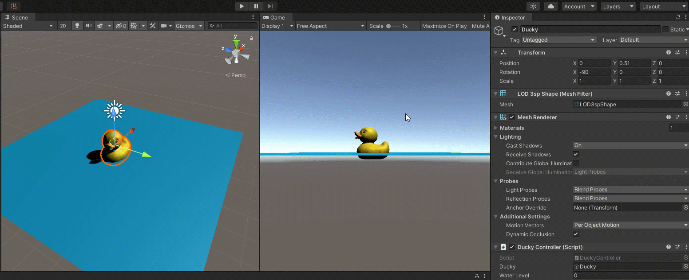
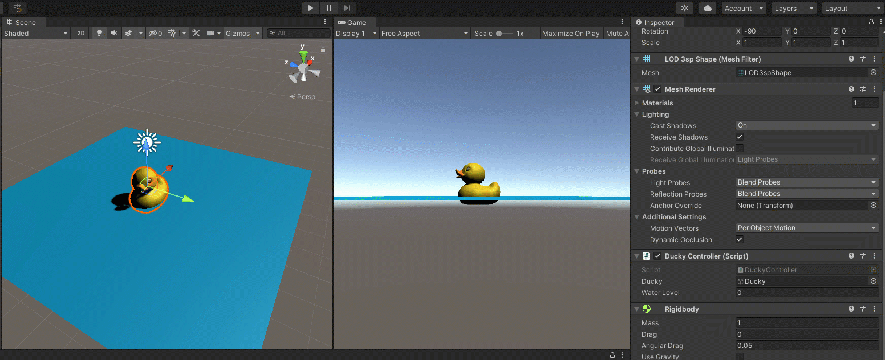

# Rubber Ducky Activity \(Unity\)

## Step 1: Import the Rubber Ducky Asset

After downloading the Rubber Ducky Unity Package from Blackboard, open a Unity Project.

### 1a. Create a New Scene

In the Project tab, click on the Scenes folder under Assets.

Right-click in the tab and select.


Give it a name and press ENTER to confirm.

Double-click to open the scene.

It will have a Main Camera and Directional light.

### 1b. Import the Unity Package

Under the Assets menu, select Import Package &gt; Custome Package...


Find and select the Rubber Ducky Unity Package.

Click the **Import** button. This will add a Prefabs folder with two assets - the model and a game object with the material - and add to an existing Materials folder or add a new one with the texture and material for the duck.


## 2. Preparing the Rubber Duck Asset

I originally downloaded this asset from [Google Poly](https://poly.google.com/view/f2HXnJnJKql), opened and exported it from Blender, then got it to have the correct material in Unity. Somewhere in that process, it made the rotation a bit weird and I kept it in a "parent" empty game object. This extra step is to just get the ducky by itself, but you might run into issues if you play with rotation.

### 2a. Add the Ducky asset to the scene

Go to your Prefabs folder in the Project tab.

Click and drag the "rubberDuckyWithColor" asset to your scene in the Scene tab or Hierarchy Tab.

To make it centered, click on your duck. In the Inspector tab, right-click on the name of the Transform component and select **Reset Postion**.


### 2b. Unparent the Ducky

In the Hierarchy tab, twirl down the "rubberDuckyWithColor" to see the "children" objects.


If you try to click and drag the LO3spShape object out of rubberDuckyWithColor, you'll get this error:


So instead, first, right-click on rubberDuckyWithColor and select Prefab &gt; Unpack Completely.


This will remove the blue text and you can now click and drag the shape out of its parent.


Delete the empty rubberDuckyWithColor object and rename your LOD3spShape.


## 3. Put the Ducky in "Water"

For this activity, it's the best to move your Game tag over to make it visible at the same time as your Scene Tab.


Create a plane by right-clicking in your Hierarchy tab and selecting 3D Object &gt; Plane.


Name it! I named mine Water.

You can move it around or use the Inspector tab to get it to the coordinates 0, 0, 0.


I want to use the water as a "horizon" line or "water level," so I raised it using the **Move Tool** \(on the top left\) to raise it to around 0.89 for the Y axis.


The duck is a bit too low in my project - in yours, it might seem too high. Select and adjust your duck to the height you like.


We want the duck to go through the "water" so select your water object and remove or disable the Mesh Collider.


Let's color correct this, starting with the light.

Click on your Directional Light in the Hierarchy tab.

In the Inspector tab, change the color from the default yellow to white \(or whatever you like\).


Now, we can also add a color to the water.

In your Project tab, go to your Assets &gt; Materials folder.

Create a new material:


Name it! \(I chose "Water"\)

Then, select the new material and change the Albedo color to the color you want in the Inspector tab.


Click and drag your material to your water object.


## 4. Add a Script to Make the Duck Float

Let's make a script to have the duck appear to float when it's below the surface of the water.

In your Project tab, go to your Assets &gt; Scripts folder \(or create a Scripts folder\).

Right-click and create a new C\# Script:


Give it a name that:

1. Is all one word
2. Starts with a capital letter

I'll name mine "DuckyController"


Double-click to open the Script.


IMPORTANT: The name of your script MUST match the name that follows the word "class" in your script - usually on line 5.



Since we are wanting to modify our ducky object, we should store it in a variable. If we make it **public**, we can assign this in Unity. Place this inside the class, but above the `Start()` function.

```csharp
public GameObject ducky;
```

Once we have an object, we can "dig in" to it so-to-speak and get its properties, associated functions, etc. When we do this, we start with the largest thing - the object, then go smaller and smaller until we get to values, with each level deeper separated by a period.

For example, if we want to get the y position/coordinate of whatever is stored as the ducky variable, we could use:

`ducky.transform.position.y`

We start with the largest, the game object, then grab its transform component, then grab the position property, then get just the y value.

So to test to see if the ducky is under say, 0, we'd use:

```csharp
if (ducky.transform.position.y < 0) { }
```

If it is too low, we want to move the duck upward.

We will put this in the Update\(\) function so that it will check the duck location and move it on EVERY frame where the if statement is true.

We can move it up using the following code:

```csharp
ducky.transform.position += Vector3.up * Time.deltaTime;
```

You aren't able to update JUST the y value. With positions, rotations, and scaling, all three coordinates need to be given in a `new Vector3(x, y, z)` format.

A shortcut for `new Vector3(0, 1, 0)` is `Vector3.up` - it's like saying, "Hey, Unity, give me your Vector3 options and give me the shortcut for 'up.'"

**`Time.deltaTime`** is a modifier that helps all computers run the code at around the same speed. Again, it's like asking Unity for all the Time options and selecting deltaTime from them.

The `+=` shortcut stands for "add to existing."

Final code for this step:

```csharp
using System.Collections;
using System.Collections.Generic;
using UnityEngine;

public class DuckyController : MonoBehaviour
{
    // Create Variables
    public GameObject ducky;

    // Start is called before the first frame update
    void Start()
    {

    }

    // Update is called once per frame
    void Update()
    {
        if (ducky.transform.position.y < 0)
        {
            ducky.transform.position += Vector3.up * Time.deltaTime;
        }
    }
}
```

Save your code and return to Unity.

Add your script to your ducky object by clicking and dragging OR click on the ducky and add it through using the **Add Component** button.


The script will appear as a component - the last one before the material.

Replace "None \(Game Object\)" with the object you want to be stored as "Ducky." You can click and drag from the Hierarchy tab to the field OR click on the "bull's eye" icon to the right of the field and select from the options that pop up.

It should look like this when assigned:


Now, test it! Press the play button and use the **Move Tool** and move the ducky down in the Scene tab.


## 5. Make Adjustments

You'll notice that the ducky in my project doesn't go high enough - yours might go too high.

Let's update the code to find the level where we want the duck to reach when floating.

Add a variable to keep a reference of where the duck starts:

```csharp
public float waterLevel;
```

The Start\(\) function runs just once before the first frame update, so we should capture that info at that time.

```csharp
 // Start is called before the first frame update
    void Start()
    {
        waterLevel = ducky.transform.position.y;
    }
```

Then update your if statement:

```csharp
 // Update is called once per frame
    void Update()
    {
        if (ducky.transform.position.y < waterLevel)
        {
            ducky.transform.position += Vector3.up * Time.deltaTime;
        }
    }
```

When you go back to Unity, you'll see the component has been updated:


When you press play, the number will update to where your ducky starts.


Test it out!



## 6. Adding Gravity

Now, let's have it fall as well!

We can add gravity with a **Rigidbody** component.

Add the Rigidbody component through the **Add Component** button when you have the ducky selected.


This adds gravity by default.


If you play the game now, it will fall and keep falling.

So let's add to our script code that turns off gravity at the water level and on when above water level.

Here, we will check if the ducky is above water level to run code and otherwise - else - run a different code.

```csharp
if (ducky.transform.position.y > waterLevel) { }
else { }
```

To get to the "Use Gravity" property of the Rigidbody component, we can go through the ducky object it's attached to!

To turn on the gravity, use:

```csharp
ducky.GetComponent<Rigidbody>().useGravity = true;
```

The GetComponent&lt;&gt;\(\) function looks into the object is attached to and locates the type of component in the angle brackets &lt;&gt;. Once it has that, it can find the properties and values. Not only can it get them, but you can also usually update them.

Here is the final code for this step:

```csharp
using System.Collections;
using System.Collections.Generic;
using UnityEngine;

public class DuckyController : MonoBehaviour
{
    // Create Variables
    public GameObject ducky;
    public float waterLevel;

    // Start is called before the first frame update
    void Start()
    {
        waterLevel = ducky.transform.position.y;
    }

    // Update is called once per frame
    void Update()
    {
        if (ducky.transform.position.y < waterLevel)
        {
            ducky.transform.position += Vector3.up * Time.deltaTime;
        }

        if (ducky.transform.position.y > waterLevel)
        {
            // Turn on gravity
            ducky.GetComponent<Rigidbody>().useGravity = true;
        }
        else
        {
            // Turn off gravity
            ducky.GetComponent<Rigidbody>().useGravity = false;
        }
    }
}
```

Try it!



Whoops! Looks like gravity is stronger than the float code!

## 7. Removing Velocity

Rigidbody functions tend to add velocity to objects, so there's a lot of force that keeps an object moving.

BUT we can turn that off by changing the velocity to zero when we turn off the gravity.

```csharp
ducky.GetComponent<Rigidbody>().velocity = Vector3.zero;
ducky.GetComponent<Rigidbody>().angularVelocity = Vector3.zero;
```

Just like `useGravity`, velocity is a property \(seen under _Info_ in the Unity component\) that can be updated.

`Vector3.zero` is a shortcut for `new Vector3(0, 0, 0);`

Final code for this step:

using System.Collections; using System.Collections.Generic; using UnityEngine;

public class DuckyController : MonoBehaviour { // Create Variables public GameObject ducky; public float waterLevel;

```csharp
// Start is called before the first frame update
void Start()
{
    waterLevel = ducky.transform.position.y;
}

// Update is called once per frame
void Update()
{
    if (ducky.transform.position.y < waterLevel)
    {
        ducky.transform.position += Vector3.up * Time.deltaTime;
    }

    if (ducky.transform.position.y > waterLevel)
    {
        // Turn on gravity
        ducky.GetComponent<Rigidbody>().useGravity = true;
    }
    else
    {
        // Turn off gravity and remove velocity
        ducky.GetComponent<Rigidbody>().useGravity = false;
        ducky.GetComponent<Rigidbody>().velocity = Vector3.zero;
        ducky.GetComponent<Rigidbody>().angularVelocity = Vector3.zero;
    }
}
```

Test it out!


