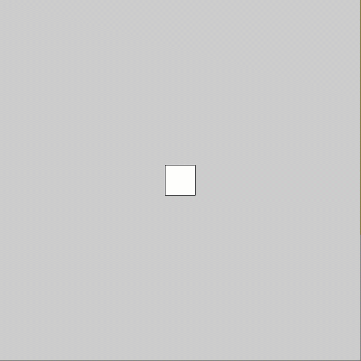
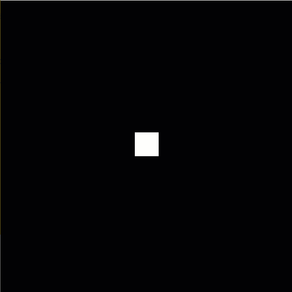
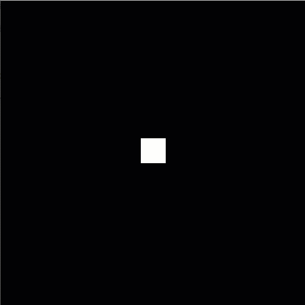
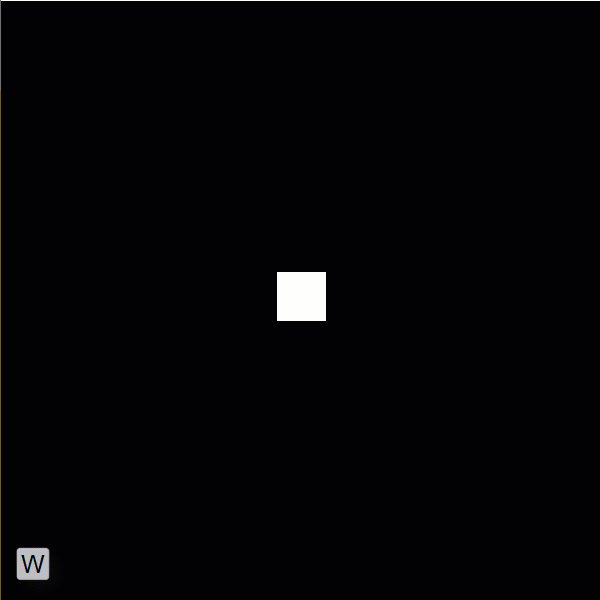

# Movement Using If Statements In Processing

The steps below walk you through a Processing activity that creates movement using the looping `draw()` function and if statments. All code should allow you to copy and paste.

## Step 1: Create a Canvas and Player

Create a canvas in `setup()` and a "player" that will move - I'm using a square here.

```java
void setup() {
    size(600, 600);        // Creates a 600 x 600 canvas

    // Create a 50 x 50 square at coordinates (300, 300)
    rect(300, 300, 50, 50);    
}
```

Output when played:


You'll notice that the square isn't in the center.

Why?

The default mode for rectangles/squares in Processing puts the origin at the top left. To put it in the center, we need to change the `rectMode()` before we draw the rectangle.

```java
void setup() {
    size(600, 600);        // Creates a 600 x 600 canvas

    // Change rectMode() to draw the origin (x, y) coordinates 
    // in the center of the square
    rectMode(CENTER);

    // Create a 50 x 50 square at coordinates (300, 300)
    rect(300, 300, 50, 50);    
}
```

Output when played:


## Step 2: Use Variables Instead of Values

We'll be using the coordinates and the size of the player square in other code, so let's put the values in reusable variables.

```java
float x = 300;
float y = 300;
float size = 50;

void setup() {
    size(600, 600);        // Creates a 600 x 600 canvas

    // Change rectMode() to draw the origin (x, y) coordinates in the center of the square
    rectMode(CENTER);

    // Create a square at the coordinates provided in the variables
    rect(x, y, size, size);    
}
```

## Step 3: Adding Interaction

Processing has a built-in function called `keyPressed()` that runs when a key is pressed on the keyboard. The key that is pressed gets stored as a **char** type \(like a one-character string\).

Copy and paste the `rect()` code into a `keyPressed()` function outside and after the `setup()` function.

```java
void keyPressed() {
  rect(x, y, size, size);
}
```

Let's add **movement**.

If you want to move the square up, you want to draw it at a y coordinate that's less than the frame before. So before you draw the square, update `y`.

```java
void keyPressed() {

  // Subtract 5 from y each time a key is pressed
  y -= 5;

  rect(x, y, size, size);
}
```

Since this new function draws a rectangle, we need a `draw()` function. Let's put it between the `setup()` and `keyPressed()`.

Here is the full code so far:

```java
float x = 300;
float y = 300;
float size = 50;

void setup() {
    size(600, 600);        // Creates a 600 x 600 canvas

    // Change rectMode() to draw the origin (x, y) coordinates in the center of the square
    rectMode(CENTER);

    // Create a square at the coordinates provided in the variables
    rect(x, y, size, size);    
}

void draw() {
}

void keyPressed() {

  // Subtract 5 from y each time a key is pressed
  y -= 5;

  rect(x, y, size, size);
}
```

Output when played:

This movement will happen with any key.



As you can see, only the square is being drawn over itself.

To make it look like the square is moving instead of being redrawn, add code to draw a background prior to the square in both `setup()` and `keyPressed()`. Here, the background is black:

```java
float x = 300;
float y = 300;
float size = 50;

void setup() {
    size(600, 600);        // Creates a 600 x 600 canvas

    // Change rectMode() to draw the origin (x, y) coordinates in the center of the square
    rectMode(CENTER);

    // Draw a black background
    background(0);      // Equivalent to background(0, 0, 0);

    // Create a square at the coordinates provided in the variables
    rect(x, y, size, size);    
}

void draw() {
}

void keyPressed() {

  // Subtract 5 from y each time a key is pressed
  y -= 5;

  background(0);
  rect(x, y, size, size);
}
```

Output when played:



## Step 4: Refining Movement

First, let's put the value that we are moving `y` to its own variable, speed. This way, the amount of movement can be updated once instead of for each direction of movement.

```java
float speed = 5;

...

y -= speed;

...
```

Now, we can start using an **if statement** to tell the program to run the code to change the `y` value ONLY when the 'w' key is pressed.

In all cases, we want the background and square drawn, so it stays outside of the if statement block.

Since the key pressed is stored as the built-in variable named `key`, let's compare `key` to 'w' to see if it matches. If it does, we want the code to run.

```java
...

void keyPressed() {

  // Go up if 'w' is pressed
  if (key == 'w') {
    y -= speed;
  }

  background(0);
  rect(x, y, size, size);
}
```


`key` is a **char** type variable. It's one of the few times when you MUST use single quotes for the 'w' \(comparison value\).


Output when played \(keys pressed added to the graphic\):



## Step 5: Add Other Directions

Copy and paste the if statement or practice typing the if statement and update the comparison value \(checking what key to match\) and changing the direction `y` will change.

```java
...

void keyPressed() {

  // Go up if 'w' is pressed
  if (key == 'w') {
    y -= speed;
  }

  // Go down if 's' is pressed
  if (key == 's') {
    y += speed;
  }

  background(0);
  rect(x, y, size, size);
}
```

Copy and paste the two if statements or practice typing them and update the axis and the comparison value \(checking what key to match\).

```java
...

void keyPressed() {

  // Go up if 'w' is pressed
  if (key == 'w') {
    y -= speed;
  }

  // Go down if 's' is pressed
  if (key == 's') {
    y += speed;
  }

  // Go left if 'a' is pressed
  if (key == 'a') {
    x -= speed;
  }

  // Go right if 'd' is pressed
  if (key == 'd') {
    x += speed;
  }

  background(0);
  rect(x, y, size, size);
}
```

## Step 6: Get It Working for Lower and Upper Case

Right now, this code only works when the CAPSLOCK is off. To avoid errors, let's say to also run the code with the upper case of each.

We can add a second "test" to the if statements with the logical operator, OR, which is written as "pipes" or `||` between the tests.

With OR, only one of the tests has to be true for the code to run.

```java
...

void keyPressed() {

  // Go up if 'w' or 'W' is pressed
  if (key == 'w' || key == 'W') {
    y -= speed;
  }

  // Go down if 's' or 'S' is pressed
  if (key == 's' || key == 'S') {
    y += speed;
  }

  // Go left if 'a' or 'A' is pressed
  if (key == 'a' || key == 'A') {
    x -= speed;
  }

  // Go right if 'd' or 'D' is pressed
  if (key == 'd' || key == 'D') {
    x += speed;
  }

  ...
```

## Full Code

```java
float x = 300;
float y = 300;
float size = 50;
float speed = 5;

void setup() {
    size(600, 600);        // Creates a 600 x 600 canvas

    // Change rectMode() to draw the origin (x, y) coordinates in the center of the square
    rectMode(CENTER);

    // Draw a black background
    background(0);      // Equivalent to background(0, 0, 0);

    // Create a square at the coordinates provided in the variables
    rect(x, y, size, size);    
}

void draw() {
}

void keyPressed() {

  // Go up if 'w' or 'W' is pressed
  if (key == 'w' || key == 'W') {
    y -= speed;
  }

  // Go down if 's' or 'S' is pressed
  if (key == 's' || key == 'S') {
    y += speed;
  }

  // Go left if 'a' or 'A' is pressed
  if (key == 'a' || key == 'A') {
    x -= speed;
  }

  // Go right if 'd' or 'D' is pressed
  if (key == 'd' || key == 'D') {
    x += speed;
  }

  background(0);
  rect(x, y, size, size);
}
```

Output when played \(keys pressed added to the graphic\):



