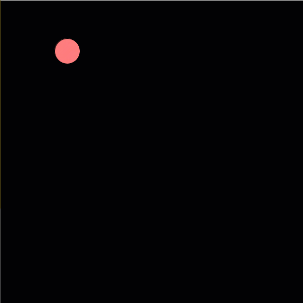

# Moving Shapes in Processing

The steps below walk you through a Processing activity that moves a shape using the looping `draw()`function. All code should allow you to copy and paste.

## Loops

Loops are often used to control movement in some art programs. Here is an example of how a shape can move in Processing using a loop using the `draw()` function's looping nature:

## Step 1:  Create the Shape

In this example, we will use a circle, but this will work with rectangles, squares, and even text!

```java
void setup() {
  // 600 x 600 canvas
  size(600, 600);

  // Have the pivot point be the center of the shape
  ellipseMode(CENTER);
}

void draw() {
  // Draws a black background
  background(0);

  // Color of the shape
  fill(255, 125, 125);

  // Draws a 50 x 50 circle at (100, 100)
  ellipse(100, 100, 50, 50);
}
```

Output when played:


## Step 2: Creating Variables for Varying Values

The `x` and `y` locations will change as we move the shape across the screen, so let's put those values in variables.

```java
float x = 100;
float y = 100;

void setup() {
  // 600 x 600 canvas
  size(600, 600);

  // Have the pivot point be the center of the shape
  ellipseMode(CENTER);
}

void draw() {
  // Draws a black background
  background(0);

  // Color of the shape
  fill(255, 125, 125);

  // Draws a 50 x 50 circle at the x and y coordinates
  ellipse(x, y, 50, 50);
}
```

## Step 3: Use the Looping Nature of Draw

`draw()` loops the code once per frame, so we can use this looping nature to update the `x` coordinate for each frame.

Add a speed variable to make the speed of this movement changeable.

```java
float x = 100;
float y = 100;
float speed = 2;

void setup() {
  // 600 x 600 canvas
  size(600, 600);

  // Have the pivot point be the center of the shape
  ellipseMode(CENTER);
}

void draw() {
  // Draws a black background
  background(0);

  // Color of the shape
  fill(255, 125, 125);

  // Draws a 50 x 50 circle at the x and y coordinates
  ellipse(x, y, 50, 50);

  // Update x for every frame
  x += speed;
}
```

Output when played:



## Step 4: Change Direction with If Statements

The `draw()` function is taking care of the looping, so let's tell it how to loop by putting in some if statements.

When the circle reaches the `x` coordinate of 500, have it change to moving downward.

```java
float x = 100;
float y = 100;
float speed = 2;

void setup() {
  // 600 x 600 canvas
  size(600, 600);

  // Have the pivot point be the center of the shape
  ellipseMode(CENTER);
}

void draw() {
  // Draws a black background
  background(0);

  // Color of the shape
  fill(255, 125, 125);

  // Draws a 50 x 50 circle at the x and y coordinates
  ellipse(x, y, 50, 50);

  // Update x for every frame until it reaches 500
  if (x <= 500) {
    x += speed;
  }

  // Update y if x is around 500
  if (x >= 500) {
    y += speed;
  }
}
```

Output when played:


## Step 5: Make a Full Square

You'd think you could just use the values to say when to decrease `x` to move the shape to the left.

HOWEVER, our first if statement includes all the frames in which the `x` value is less than 500, so adding an if statement to subtract the speed will make it appear there was no difference.

Instead, we can use numbers to represent the direction the shape should move.

In each if statement, have a second if/else statement that tests for boundaries/limits. If the limit is reached, the direction is changed to the next one.

```java
float x = 100;
float y = 100;
float speed = 2;

int direction = 0;

// Directions:
// 0: to the right
// 1: downward
// 2: to the left
// 3: upward

void setup() {
  // 600 x 600 canvas
  size(600, 600);

  // Have the pivot point be the center of the shape
  ellipseMode(CENTER);
}

void draw() {
  // Draws a black background
  background(0);

  // Color of the shape
  fill(255, 125, 125);

  // Draws a 50 x 50 circle at the x and y coordinates
  ellipse(x, y, 50, 50);

  if (direction == 0) {

    // Limit how far
    if (x <= 500) {
      x += speed;
    }
    else {
      // once limit is reached, change direction
      direction = 1;
    }
  } 

  if (direction == 1) {
    // Limit how far
    if (y <= 500) {
      y += speed;
    }
    else {
      // once limit is reached, change direction
      direction = 2;
    }
  }

  if (direction == 2) {
    // Limit how far
    if (x >= 100) {
      x -= speed;
    }
    else {
      // once limit is reached, change direction
      direction = 3;
    }
  }

  if (direction == 3) {
    // Limit how far
    if (y >= 100) {
      y -= speed;
    }
    else {
      // once limit is reached, go back to first direction
      direction = 0;
    }
  }
}
```

Output when played:


