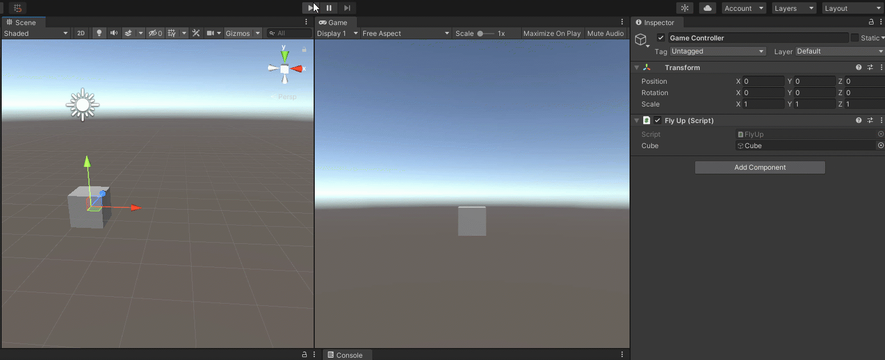
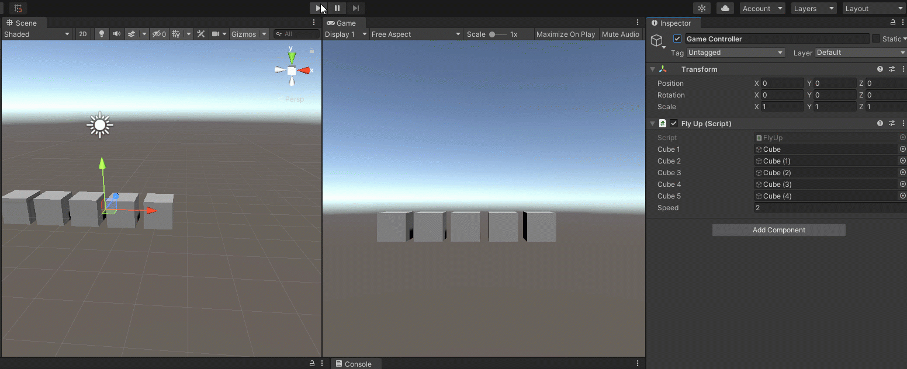
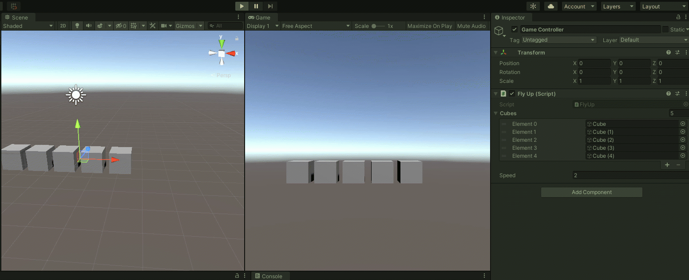

# Using For and Foreach Loops in Unity

The steps below walk you through a Unity activity we did during Week 4. All code should allow you to copy and paste.

## Step 1: Create a New Scene

Once opening a Unity project, in the Project tab, click on the Scenes folder under Assets.

Right-click in the tab and select.


Give it a name and press ENTER to confirm.

Double-click to open the scene.

It will have a Main Camera and Directional light.

## **Step 2: Add an Object**

In the Hierarchy window, right-click, then choose a primitive shape under "3D Object" For this exercise, I'll be using cubes.


My default appears like this:



If you cannot see your object in the Scene window, select the object in the Hierarchy window. Then hover over the Scene window and press the F key to "focus" on the selected item. You can select multiple items to bring them all into frame.


I am going to use my right mouse button and middle button to rotate the scene to have the red X-axis on the gizmo on the top right to be on the right side:


This means moving the object to the left will move it into the negative end of X and right will be positive numbers.

Speaking of positioning...

## Step 3: Reset the Position

When you create an object, it might use the position, rotation, and size from another object.

Each game object has a **Transform** component that holds and displays the position, rotation, and scale \(size\) of the object.

Select the cube and you should see this Transform info in the **Inspector** window.


**Note:** Obviously, there are several other components for the shape, but we are focusing on the Transform for this exercise.

To reset the position and rotation to zeros and the scale to 1 x 1 x 1, right-click on "Transform" and click "Reset."


It should now look like this:



You might have to refocus in the Scene window \(press F\).


## Step 4: Add a Script

In this script, we are making our shape fly upward.

In the Project window, right-click and choose Create &gt; C\# Script:


It will appear like this, ready to give the script a name:


I'm naming this FlyUp.cs:



Names are in Pascal casing and no spaces. It must match the class name within the script, so any renaming here needs to also happen within the script.


## Step 5: Add the Code

Double-click on the script. It should load Visual Studio with default code:

```csharp
using System.Collections;
using System.Collections.Generic;
using UnityEngine;

public class FlyUp : MonoBehaviour
{
    // Start is called before the first frame update
    void Start()
    {

    }

    // Update is called once per frame
    void Update()
    {

    }
}
```

**`Start()`** is like `setup()` in Processing - it runs once and on the first frame

**`Update()`** is like `draw()` in Processing - it runs once per frame and loops indefinitely

To affect the cube, we'll put it in a variable above and outside of `Start()`:

```csharp
public GameObject cube;
```

**`public`** is the _**scope**_ of the variable - `public` will allow it to be used by multiple blocks of code/functions within this script as well as other scripts AND it makes it visible in the Inspector window.

**`GameObject`** is the type of variable - we are using this variable to access other components attached to the object like the Transform component \(and thus, the stored info for position, rotation, and scale\) of the cube.

The name of the variable is like any other - use camel casing and no spaces!

We do not need to set what this variable is because we will do it through the user interface.

Inside the `Update()` function, we want to update the cube to add to the y-axis.

The LONG way would look something like this:

```csharp
cube.transform.position += new Vector3(0, 1, 0);
```

Here, we are using the . \(dot\) to access the Transform component and then its position information in the game object, `cube`.

We are adding to the Y value. Unity doesn't like updating just one axis, so a full Vector3 \(a set of three floating point values - often thought of x, y, and z coordinates\) needs to be defined.

Here is a shorthand way to do the same thing:

```csharp
cube.transform.position += Vector3.up;
```

These shorthands exist for left, right, up, down, forward, and back and adjust the appropriate axis by 1. MEANING we can multiply modifiers to affect speed, etc.

We need to "normalize" the speed, so we'll multiply the shortcut by Time.deltaTime;

```csharp
cube.transform.position += Vector3.up * Time.deltaTime;
```

Our code so far:

```csharp
using System.Collections;
using System.Collections.Generic;
using UnityEngine;

public class FlyUp : MonoBehaviour
{
    public GameObject cube;

    // Start is called before the first frame update
    void Start()
    {

    }

    // Update is called once per frame
    void Update()
    {
        cube.transform.position += Vector3.up * Time.deltaTime;
    }
}
```

## Step 6: Add the Script to the Scene

Save your script.

Go back to Unity.

We'll be using this script for multiple items, so let's create an empty game object to hold our scripts.

In Hierarchy, right-click and select "Create Empty."


Once created, you can rename it by selecting it and single-clicking it.

I named mine "Game Controller" \(out of habit\), but you can name it whatever works for you.

I also click and dragged it to the top of my list of objects.

Select the empty game object.

Click and drag the FlyUp script from the Project window into the Inspector window to add it to the game object OR press the **Add Component** button and find the script.

Here's what the Inspector looks like with Game Controller selected:


Don't worry about the Transform component here since we are concerned only with the added scripts/components.

You'll notice our variable appears and is currently "None" and looking for a GameObject type.

You can click and drag the cube from the Hierarchy window OR click the bull's eye symbol on the right side of the variable to bring up a list of possible objects in your scene.


Double-click on cube \(or whatever your shape is\).

It now shows as stored as our cube variable:


## Step 7: Test the Code

Click the play button at the top of the screen.

Output when played:




My settings have my screen turn green when I hit play. Yours might not change color.


## Step 8: Adding a Speed Modifier

We might want to modify how fast this is flying up, so let's add a speed modifier.

Go to your script.

Add a variable named `speed` that holds a **float**. It doesn't matter what you initialize speed to since you can update it in Unity.

```csharp
public float speed = 5;
```

Now, multiply it to your `Vector3.up` line. It doesn't matter where since it's multiplication. I will add it right after the `Vector3.up`.

```csharp
cube.position += Vector3.up * speed * Time.deltaTime;
```

Code so far:

```csharp
using System.Collections;
using System.Collections.Generic;
using UnityEngine;

public class FlyUp : MonoBehaviour
{
    public GameObject cube;
    public float speed = 5;

    // Start is called before the first frame update
    void Start()
    {

    }

    // Update is called once per frame
    void Update()
    {
        cube.transform.position += Vector3.up * speed * Time.deltaTime;
    }
}
```

Save the script and go back to Unity.

It will update and the FlyUp component on Game Controller will have the new variable.


You can now adjust this speed and it will modify the speed in which the cube moves up.

## Step 9: Add More Cubes

Click on your cube \(or other shape\).

You can right-click copy and right-click paste, use CTRL+C / CTRL+V, OR what I like doing: CTRL+D to **duplicate**.

This makes a copy and adds a number after the name.


It also duplicates the position, rotation, and scale, so it will be overlapping the one you duplicated.

Use the coordinates in the Transform object OR click the **move tool** button on the top left and click and drag the vectors for each duplicate - preferably in a row:


If you want to move them all to the left at once, click the first cube and CTRL+click each extra one you want to select. You can move them all at the same time.


Go back to your FlyUp script.

Add variables for the new cubes \(you can replace the first one with `cube1`\):

```csharp
public GameObject cube1;
public GameObject cube2;
public GameObject cube3;
public GameObject cube4;
public GameObject cube5;
```

Copy and paste the code in `Update()` and update it to apply to the new cubes.

```csharp
cube1.transform.position += Vector3.up * speed * Time.deltaTime;
cube2.transform.position += Vector3.up * speed * Time.deltaTime;
cube3.transform.position += Vector3.up * speed * Time.deltaTime;
cube4.transform.position += Vector3.up * speed * Time.deltaTime;
cube5.transform.position += Vector3.up * speed * Time.deltaTime;
```

Full code:

```csharp
using System.Collections;
using System.Collections.Generic;
using UnityEngine;

public class FlyUp : MonoBehaviour
{
    public GameObject cube1;
    public GameObject cube2;
    public GameObject cube3;
    public GameObject cube4;
    public GameObject cube5;

    public float speed = 5;

    // Start is called before the first frame update
    void Start()
    {

    }

    // Update is called once per frame
    void Update()
    {
        cube1.transform.position += Vector3.up * speed * Time.deltaTime;
        cube2.transform.position += Vector3.up * speed * Time.deltaTime;
        cube3.transform.position += Vector3.up * speed * Time.deltaTime;
        cube4.transform.position += Vector3.up * speed * Time.deltaTime;
        cube5.transform.position += Vector3.up * speed * Time.deltaTime;
    }
}
```

Look at all that repetition!

Save the script and go back to Unity.

Click on Game Controller \(or the object with your script\). It will now show the new variables:


Using the click-and-drag method or the click-on-the-bull's-eye method to assign the new cubes to the new variables.


Once those are assigned, test it!



## Step 10: Using a Foreach Loop to Make Things More Efficient

Our code is very repetitive and takes up a lot of lines. Imagine trying to modify the movement code for 100 or more objects!

Let's consolidate it with a Foreach loop.

A **foreach** loop takes each element of a group \(also known as an array or list\) and runs code on it.

We first need to create our array or group of objects.

Replace your cube variables with this:

```csharp
public GameObject[] cubes;
```

The square brackets `[]` after the type tells the computer this variable will hold multiple of this type.

I usually give it a plural name to remember that it's a group of objects.

Replace the code in the Update\(\) function with this loop:

```csharp
foreach (GameObject cube in cubes)
{
    cube.transform.position += Vector3.up * speed * Time.deltaTime;
}
```

**`foreach`** is the type of loop.

In the parentheses, we declare/create a temporary variable \(`cube`\), then use the keyword **`in`** followed by the name of our array, list, or group \(`cubes`\).

Then, we put the code we want to happen to each element \(temporarily stored here as `cube`\) for each frame inside the curly brackets `{}`.

Full code:

```csharp
using System.Collections;
using System.Collections.Generic;
using UnityEngine;

public class FlyUp : MonoBehaviour
{
    public GameObject[] cubes;

    public float speed = 5;

    // Start is called before the first frame update
    void Start()
    {

    }

    // Update is called once per frame
    void Update()
    {
        foreach (GameObject cube in cubes)
        {
            cube.transform.position += Vector3.up * speed * Time.deltaTime;
        }
    }
}
```

Save this and return to Unity.

Your FlyUp component on GameController will look different.

In Unity 2020.2 and newer, the array will appear with its size to the right of it. Here, it is zero because we haven't said how big it is.


We have five cubes, so make it 5.


Click on the arrow to the left of the array name \(Cubes\) to see the list of elements.


Reassign your cubes.


Now, test it!



You can even add another cube!

Duplicate the last one listed - Cube \(4\) - and move it to where you can see it.


Click on Game Controller, and add an element under Cubes, using the plus sign and assigning the new cube as Element 5.


This will still work without having to update your script!


## Step 11: Using a For Loop to Effect Individual Elements

Foreach loops are good for running the same exact code on each element of the group, array, or list.

But what if we want to check a property of one of the other elements?

Let's change our foreach loop to a for loop.

```csharp
for (int i = 0; i < cubes.Length; i++)
{
    cubes[i].transform.position += Vector3.up * speed * Time.deltaTime;
}
```

**`for`** is the type of loop.

In the parentheses, we create and initialize a temporary variable, `i`, \(which stands for _index_, another word for an element's position in a list\) to zero.

We also say to run the code only when the variable `i` is less than the number of elements in our array by using the name of the array \(`cubes`\), then a dot, then the word `Length` to get its size, count, or length.

Finally, we say what to do at the end of every time it runs through the loop: `i++` which is shorthand for `i = i + 1` so it updates `i` by one each time.

The code we want to run is in the curly brackets `{}`.

This time, instead of just cube, we use the name of our array followed by square brackets `[]` with the number of the element inside. For example, `cubes[0]` is the first element or Element 0 and `cubes[3]` is the fourth element or Element 3.

Here, we use `i` to stand for this number.

Save and test your code. It should look the same as before.

Let's have it where every cube only starts moving when the cube before it is about 2 units up. We can get the position of the cube prior to the current cube by using the _index_ number. We know the previous cube will be one less than the current one, so its index will be `i - 1`

```csharp
for (int i = 0; i < cubes.Length; i++)
{
    // If the previous cube is at least 2 units up
    if (cubes[i - 1].transform.position.y >= 2)
    {
        // Move the current cube upward
        cubes[i].transform.position += Vector3.up * speed * Time.deltaTime;
    }
}
```

If you save and run the program, now, you'll get this common error in your Console window:


An IndexOutOfRangeException \(sometimes "out of bounds"\) means it's trying to get an element that doesn't exist - either one more than available or in this case, Element -1.

So other if statements can test to see if it's the first element so that it knows not to check for a "previous" cube.

```csharp
for (int i = 0; i < cubes.Length; i++)
{
    // if it's the second cube or further down the line
    if (i > 0)
    {
        // Check if the previous cube is at least 2 units up
        if (cubes[i - 1].transform.position.y >= 2)
        {
            // If it is, move the current cube upward
            cubes[i].transform.position += Vector3.up * speed * Time.deltaTime;
        }
    }

    // If the current cube is the first cube
    if (i == 0)
    {
        // Move the current cube upward
        cubes[i].transform.position += Vector3.up * speed * Time.deltaTime;
    }

}
```

Here's the full code:

```csharp
using System.Collections;
using System.Collections.Generic;
using UnityEngine;

public class FlyUp : MonoBehaviour
{
    public GameObject[] cubes;

    public float speed = 5;

    // Start is called before the first frame update
    void Start()
    {

    }

    // Update is called once per frame
    void Update()
    {
        for (int i = 0; i < cubes.Length; i++)
        {
            // if it's the second cube or further down the line
            if (i > 0)
            {
                // Check if the previous cube is at least 2 units up
                if (cubes[i - 1].transform.position.y >= 2)
                {
                    // If it is, move the current cube upward
                    cubes[i].transform.position += Vector3.up * speed * Time.deltaTime;
                }
            }

            // If the current cube is the first cube
            if (i == 0)
            {
                // Move the current cube upward
                cubes[i].transform.position += Vector3.up * speed * Time.deltaTime;
            }

        }
    }
}
```

Here's what it looks like:


Try adding more cubes, adding to the array in the Inspector window and see it work with different amounts of cubes!

