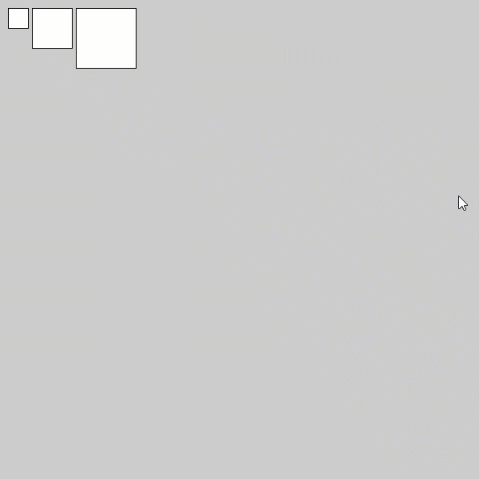
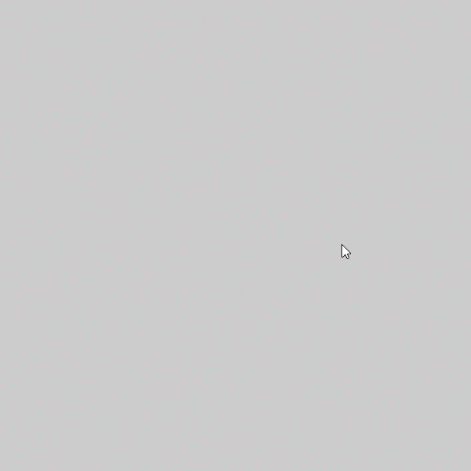
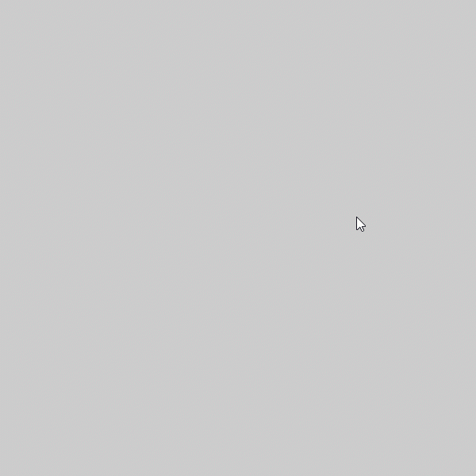
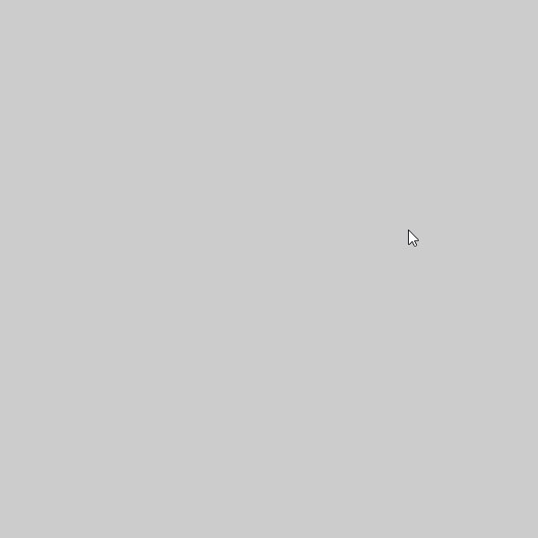

# Moving Squares Activity

The steps below walk you through the Processing activity we did during Week 5 exploring arrays and loops. All code should allow you to copy and paste.

## Step 1: Create a Canvas

Use `size()` in the `setup()` code block to create your canvas using width and height values.

```java
void setup() {
    size(600,600);
}
```

## Step 2: Create a Square

In Processing, use the `square()` function. The four pieces of information needed are:

1. x-coordinate
2. y-coordinate
3. size in pixels

Let's put this in a draw() function so that it draws it each frame.

For this example, we'll start with a 25 x 25 square with the **top left** corner at (10, 10).

```java
void setup() {
    size(600,600);
}

void draw() {
    square(10, 10, 25);
}
```

Output when played:

.png>)

## Step 3: Use Variables Instead

Let's use variables instead of values in our `square()`.

Use floating point or float variable types because coordinates and sizes can be more precise than whole numbers.

```java
float size = 25;

float xPos = 10;
float yPos = 10;

void setup() {
    size(600,600);
}

void draw() {
    square(xPos, yPos, size);
}
```

Output when played:

.png>)

## Step 4: Create the Next Square

Let's use the width of the first to determine the x coordinate of the next square. Let's put 5 pixels of space between them.

```java
xPos += size + 5;
```

After updating `xPos`, create the next square with the same code as the first.

Full code:

```java
float xPos = 10;
float yPos = 10;

void setup() {
    size(600,600);
}

void draw() {
    square(xPos, yPos, size);
    xPos += size + 5;
    square(xPos, yPos, size);
}
```

Output when played:

.png>)

Oops! We only want two squares right now!

Because of the looping nature of `draw()`, `xPos` will continue to update forever. To keep it to only two squares being drawn over each other and appear as two squares, update `xPos` at the end of the `draw()` function.

Full code:

```java
float size = 25;

float xPos = 10;
float yPos = 10;

void setup() {
    size(600,600);
}

void draw() {
    square(xPos, yPos, size);
    xPos += size + 5;
    square(xPos, yPos, size);
    
    // Reset xPos
    xPos = 10;
}
```

Output when played:

.png>)


## Step 5: Making the Sizes Different

Let's add a variable to hold a different size for the second square.

Rename "size" to "size0" for the first square and name the size variable for the second "size1".

```java
float size0 = 25;
float size1 = 50;
```

Update the names of the variables in the setup() code.

Full code:

```java
float size0 = 25;
float size1 = 50;

float xPos = 10;
float yPos = 10;

void setup() {
    size(600,600);
}

void draw() {
    square(xPos, yPos, size0);
    xPos += size0 + 5;
    square(xPos, yPos, size1);
    
    // Reset xPos
    xPos = 10;
}
```

Output when played:

.png>)

## Step 6: Make a Third Square

Make a third square with the same method. 

Create a variable to hold the size of the new square.

Add the width of the last square to `xPos` plus 5 more pixels for spacing.

Then create the square with the new x and the new variable.

```java
float size0 = 25;
float size1 = 50;
float size2 = 75;

float xPos = 10;
float yPos = 10;

void setup() {
    size(600,600);
}

void draw() {
    square(xPos, yPos, size0);
    xPos += size0 + 5;
    square(xPos, yPos, size1);
    xPos += size1 + 5;
    square(xPos, yPos, size2);
    
    // Reset xPos
    xPos = 10;
}
```

Output when played:

.png>)

## Step 7: Switching to Arrays Instead of Variables

We are going to eventually add an unknown number of these squares, so we should put a list of the size values within one array. That way, we can add to it while the sketch is playing.

To do this, create an array variable and list the values:

```java
float sizes[] = { 25, 50, 75 };
```

Imagine each value as a one-column table starting with Row 0. The row number is the **index** number we are wanting to access.

Then, we can use the array and index as a variable by using the array name followed by the index in square brackets **\[ ]**:

```java
    square(xPos, yPos, sizes[0]);
    xPos += sizes[0] + 5;
    square(xPos, yPos, sizes[1]);
    xPos += sizes[1] + 5;
    square(xPos, yPos, sizes[2]);
```

The variables we are no longer using can be removed.

Here is the full code:

```java
float sizes[] = { 25, 50, 75 };

float xPos = 10;
float yPos = 10;

void setup() {
    size(600,600);
}

void draw() {
    square(xPos, yPos, sizes[0]);
    xPos += sizes[0] + 5;
    square(xPos, yPos, sizes[1]);
    xPos += sizes[1] + 5;
    square(xPos, yPos, sizes[2]);
    
    // Reset xPos
    xPos = 10;
}
```

Output when played:

.png>)

## Step 8: Looping Through Array Values

The great thing about arrays is that the indices increase by 1 for each value. That means we can easily loop through a list and only have to update what index to access for information.

To loop through the code, use a **for loop**.

A for loop looks at the information in the parentheses. There are three parts in the parentheses:

1. Initiation of a counting or control variable (such as `i`, standing for _index_)
2. Conditions to run the code (when i is less than the size of our array). If the information/comparison is "true," the code following in the curly brackets `{ }` runs. Otherwise, the code is ignored.
3. What to do at the end of the loop code (updates the control variable)

Here is an example knowing we have an array with 3 values - indices run from 0-2. We don't want the loop code to run if it is 3 or higher.

```java
for (int i = 0; i < 3; i++) {  }
```

Note: `i++` is a common shorthand for `i = i + 1` or `i += 1` ...a way to add 1 to the variable.

We won't always know how big our arrays will be or are, so there is a built-in way to get information about any array we create. Using the dot `.` to get info, we can get its _length_ or size.

```java
for (int i = 0; i < sizes.length; i++) {  }
```

In the curly brackets { }, put one line of the repeated code (the square and the xPos update). The other repeated code can be removed.

```java
for (int i = 0; i < sizes.length; i++) {
    square(xPos, yPos, sizes[0]);
    xPos += sizes[0] + 5;
}
```

If we run it now, it will show just the number of elements in the array, but with the value of index 0. We need to update our loop code to use the control variable, `i`, instead.

```java
for (int i = 0; i < sizes.length; i++) {
    square(xPos, yPos, sizes[i]);
    xPos += sizes[i] + 5;
}
```

Full code:

```java
float sizes[] = { 25, 50, 75 };

float xPos = 10;
float yPos = 10;

void setup() {
    size(600,600);
}

void draw() {
    for (int i = 0; i < sizes.length; i++) {
      square(xPos, yPos, sizes[i]);
      xPos += sizes[i] + 5;
    }
    
    // Reset xPos
    xPos = 10;
}
```

Output when played:

.png>)

## Step 9: Adding Interaction

To show this array growing, let's add to the array each time the user clicks the mouse.

In Processing, there is a built-in function called `mouseClicked()` that runs a block of code ONLY when you click (press and release button of) the mouse.


As you use `mouseClicked()`, if it doesn't work right away, it might be seeing your mouse move as you click, recognizing it as a `mouseDragged()` instead. Try keeping the mouse still when you click.


Put this outside of all other blocks of code/curly brackets **{ }**.

```java
void mouseClicked() {
  // Run this code when the mouse is clicked
}
```

Every time the user clicks, a size value should be added to the sizes array. This can be done with `append()` function. Update the `sizes` array with the function, giving it two pieces of information separated by a comma: **1. what array is being updated** and **2. what value to add to it**.

This is how it looks for adding a value of 75 to sizes each time the mouse is clicked:

```java
void mouseClicked() {
  sizes = append(sizes, 100);
}
```

Full code:

```java
float sizes[] = { 25, 50, 75 };

float xPos = 10;
float yPos = 10;

void setup() {
    size(600,600);
}

void draw() {
    for (int i = 0; i < sizes.length; i++) {
      square(xPos, yPos, sizes[i]);
      xPos += sizes[i] + 5;
    }
    
    // Reset xPos
    xPos = 10;
}

void mouseClicked() {
  sizes = append(sizes, 100);
}
```

Output when played:

.gif>)

This will make each new square 100. But what if you want to make it 25 pixels bigger than the last?

Well, we can get the index number of the last size value by getting the array's _length_ and subtracting 1 because the indices start with zero.

```java
sizes.length - 1
```

Get that number using the name of the array, followed by square brackets \[ ], and put that index number in it.

```java
sizes[sizes.length - 1]
```

Then, we add 25 to it.

```java
sizes[sizes.length - 1] + 25
```

So our `append()` line now looks like this:

```java
void mouseClicked() {
  sizes = append(sizes, sizes[sizes.length - 1] + 25);
}
```

Full code:

```java
float sizes[] = { 25, 50, 75 };

float xPos = 10;
float yPos = 10;

void setup() {
    size(600,600);
}

void draw() {
    for (int i = 0; i < sizes.length; i++) {
      square(xPos, yPos, sizes[i]);
      xPos += sizes[i] + 5;
    }
    
    // Reset xPos
    xPos = 10;
}

void mouseClicked() {
  sizes = append(sizes, sizes[sizes.length - 1] + 25);
}
```

Output when played:




## Step 10: Adding Randomness

The values can be replaced with `random(min, max)` to add randomness to the sizes.

Here, we are starting with an empty array. YES! Arrays can start empty. The for loop will see that i is equal to 0 and not run.

```java
float[] sizes = { };
```

In `mouseClicked()`, instead of 100, we'll use the same random number range to get a random number between 25 and 75 each time we click:

```java
void mouseClicked() {
  sizes = append(sizes, random(25, 75));
}
```

Full code:

```java
float sizes[] = { };

float xPos = 10;
float yPos = 10;

void setup() {
    size(600,600);
}

void draw() {
    for (int i = 0; i < sizes.length; i++) {
      square(xPos, yPos, sizes[i]);
      xPos += sizes[i] + 5;
    }
    
    // Reset xPos
    xPos = 10;
}

void mouseClicked() {
  sizes = append(sizes, random(25, 75));
}
```

Output when played:



## Step 11: More Arrays and Randomness!

Thinking of the index number as a row number, we can make other arrays with information for row zero and beyond so that all index numbers work as if it is a row and each array is like a column in that row.

Let's add random color by adding arrays for `red`, `green`, and `blue` values:


Remember: Color values range from 0 (black/no color) to 255 (brightest of that color) and matching colors for all three values will result in shades of gray.


```java
float red[] = { };
float green[] = { };
float blue[] = { };
```

Since we are creating arrays, we need to add to them at the same time as the sizes array -- in the `mouseClicked()` function:

```java
void mouseClicked() {
  sizes = append(sizes, random(15, 75));
  red = append(red, random(0, 255));
  green = append(green, random(0, 255));
  blue = append(blue, random(0, 255));
}
```

In the for loop, we need to tell the computer to give the squares a color using `fill()` with values (or variables) for red, green, and blue in that order.

```java
for (int i = 0; i < sizes.length; i++) {
    fill(red[i], green[i], blue[i]);
    square(xPos, yPos, sizes[i]);
    xPos += sizes[i] + 5;
}
```

Remember to have the brackets with the `i` variable so the computer knows WHAT red, green, and blue values to get since there will be multiple.

Full code:

```java
float sizes[] = { };
float red[] = { };
float green[] = { };
float blue[] = { };

float xPos = 10;
float yPos = 10;

void setup() {
    size(600,600);
}

void draw() {
    for (int i = 0; i < sizes.length; i++) {
      fill(red[i], green[i], blue[i]);
      square(xPos, yPos, sizes[i]);
      xPos += sizes[i] + 5;
    }
    
    // Reset xPos
    xPos = 10;
}

void mouseClicked() {
  sizes = append(sizes, random(25, 75));
  red = append(red, random(0, 255));
  green = append(green, random(0, 255));
  blue = append(blue, random(0, 255));
}
```

Output when played:



## Step 12: Adding Movement

We can even make a coordinate be related to a specific square on the list by making the y position its own array.

We'll set the first at the y coordinate 10:

```java
float yPos[] = { 10 };
```


Remember to remove the original `yPos` variable.


Since we made it an array, we should update it with the others in `mouseClicked()`.

We'll use 10 as the value so each square starts at the same `yPos` value.

```java
void mouseClicked() {
  sizes = append(sizes, random(25, 75));
  red = append(red, random(0, 255));
  green = append(green, random(0, 255));
  blue = append(blue, random(0, 255));
  yPos = append(yPos, 10);
}
```

Now the `yPos` value for each square can update on each frame if we update it in the for loop.

REMEMBER: Update `yPos` in the `square()` code to be `yPos[i]` so it references the y coordinate of the specific square.

```java
for (int i = 0; i < sizes.length; i++) {
      fill(red[i], green[i], blue[i]);
      square(xPos, yPos[i], sizes[i]);
      xPos += sizes[i] + 5;
      yPos[i] += 0.5;
    }
```

Full code:

```java
float sizes[] = { };
float red[] = { };
float green[] = { };
float blue[] = { };

float xPos = 10;
float yPos[] = { 10 };

void setup() {
    size(600,600);
}

void draw() {
    for (int i = 0; i < sizes.length; i++) {
      fill(red[i], green[i], blue[i]);
      square(xPos, yPos[i], sizes[i]);
      xPos += sizes[i] + 5;
      yPos[i] += 0.5;
    }
    
    // Reset xPos
    xPos = 10;
}

void mouseClicked() {
  sizes = append(sizes, random(25, 75));
  red = append(red, random(0, 255));
  green = append(green, random(0, 255));
  blue = append(blue, random(0, 255));
  yPos = append(yPos, 10);
}
```

Output when clicked:




## Step 13: Add More Randomness

Let's make the x and y positions random.

First, turn `xPos` into an array.

```java
float xPos[] = { };
```

Remove the original `xPos` variable.

Remove the value from `yPos` to make it an empty array.

```java
float yPos[] = { };
```

Add the line to `mouseClicked()` to update `xPos` and change both `xPos` and `yPos` to add a random value between 10 and 500 to stay within the canvas.

```java
void mouseClicked() {
    sizes = append(sizes, random(25, 75));
    red = append(red, random(0, 255));
    green = append(green, random(0, 255));
    blue = append(blue, random(0, 255));
    yPos = append(yPos, random(10, 500));
    xPos = append(xPos, random(10, 500));
}
```

Update the for loop to reflect the changes of the variables using `[i]` after the `xPos` variable. 

Since `xPos` will be random, remove the line that updates `xPos`** in both the for loop and outside it.**

```java
for (int i = 0; i < sizes.length; i++) {
    fill(red[i], green[i], blue[i]);
    square(xPos[i], yPos[i], sizes[i]);
    yPos[i] += 1;
}
```

Full code:

```java
float sizes[] = { };
float red[] = { };
float green[] = { };
float blue[] = { };

float xPos[] = { };
float yPos[] = { };

void setup() {
    size(600,600);
}

void draw() {
    for (int i = 0; i < sizes.length; i++) {
      fill(red[i], green[i], blue[i]);
      square(xPos[i], yPos[i], sizes[i]);
      yPos[i] += 1;
    }
}

void mouseClicked() {
    sizes = append(sizes, random(25, 75));
    red = append(red, random(0, 255));
    green = append(green, random(0, 255));
    blue = append(blue, random(0, 255));
    yPos = append(yPos, random(10, 500));
    xPos = append(xPos, random(10, 500));
}
```

Output when played:


## Step 14: Add a Background

The black streaks you see are actually from the squares having a default black stroke of 1 pixel. Each frame, the square is moving down one pixel, so it's drawn over itself.

To have them appear to just move down when appearing, add a background to the draw() function to "reset" the background.

```java
float sizes[] = { };
float red[] = { };
float green[] = { };
float blue[] = { };

float xPos[] = { };
float yPos[] = { };

void setup() {
    size(600,600);
}

void draw() {
    background(0);  // Black background
    
    for (int i = 0; i < sizes.length; i++) {
      fill(red[i], green[i], blue[i]);
      square(xPos[i], yPos[i], sizes[i]);
      yPos[i] += 1;
    }
}

void mouseClicked() {
  sizes = append(sizes, random(25, 75));
  red = append(red, random(0, 255));
  green = append(green, random(0, 255));
  blue = append(blue, random(0, 255));
  yPos = append(yPos, random(10, 500));
  xPos = append(xPos, random(10, 500));
}
```

Output when played:


## Step 15: Random Directions

Let's take this further and have the squares move in random directions.

Make a `direction` array to store an integer that will represent a direction. I will have 0 stand for upward, 1 for right, 2 for downward, and 3 for left.

```java
int direction[] = { };
```

To make sure these arrays all have the same number of indices, add code to `mouseClicked()` to update `direction`.

```java
direction = append(direction, random(0, 3));
```

This will give you an error! We declared direction as an integer and `random()` gives us a float. We can change or _**cast**_** **the `random()` result into an integer by using `int()` and putting the `random()` code in the parentheses.

```java
direction = append(direction, int(random(0, 3)));
```

int() will take the who number of the floating point numbers from random() - this means there is an unequal chance to get a 0, 1, or 2 than a 3 because it would only be 3 at exactly 3.0. One way around this is to have the random number be between -0.51 and 3.99 (or even more precise).

```java
direction = append(direction, int(random(0, 3.99)));
```

Now, let's use if statements in the for loop to tell it where to move:

```java
if (direction[i] == 0) {
    // Move up
    yPos[i] -= 1;
}

if (direction[i] == 1) {
    // Move right
    xPos[i] += 1;
}

if (direction[i] == 2) {
    // Move down
    yPos[i] += 1;
}

if (direction[i] == 3) {
    // Move left
    xPos[i] -= 1;
}
```

Full code:

```java
float sizes[] = { };
float red[] = { };
float green[] = { };
float blue[] = { };

float xPos[] = { };
float yPos[] = { };

int direction[] = { };

void setup() {
    size(600,600);
}

void draw() {
    background(0);  // Black background
    
    for (int i = 0; i < sizes.length; i++) {
      fill(red[i], green[i], blue[i]);
      square(xPos[i], yPos[i], sizes[i]);
      
      if (direction[i] == 0) {
        // Move up
        yPos[i] -= 1;
      }
      
      if (direction[i] == 1) {
        // Move right
        xPos[i] += 1;
      }
      
      if (direction[i] == 2) {
        // Move down
        yPos[i] += 1;
      }
      
      if (direction[i] == 3) {
        // Move left
        xPos[i] -= 1;
      }
    }
}

void mouseClicked() {
  sizes = append(sizes, random(25, 75));
  red = append(red, random(0, 255));
  green = append(green, random(0, 255));
  blue = append(blue, random(0, 255));
  yPos = append(yPos, random(10, 500));
  xPos = append(xPos, random(10, 500));
  direction = append(direction, int(random(0, 3.99)));

}
```

Output when played:


