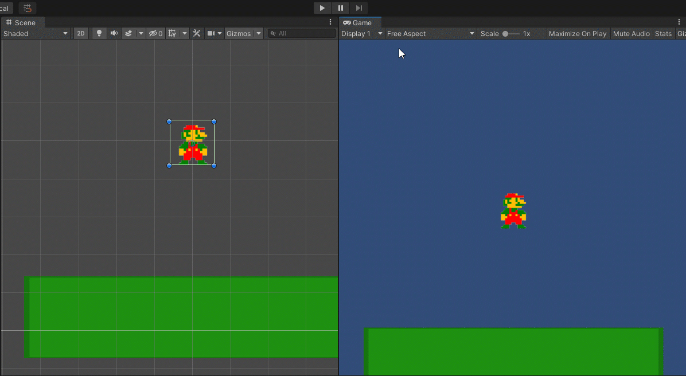
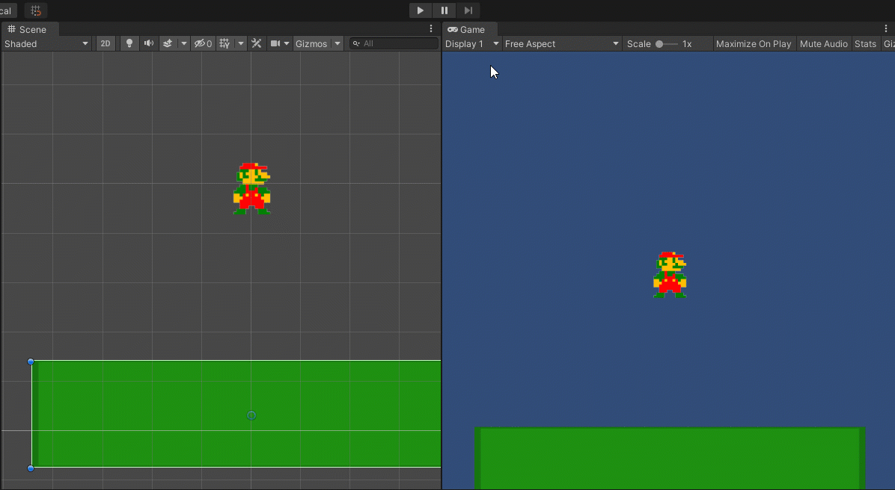
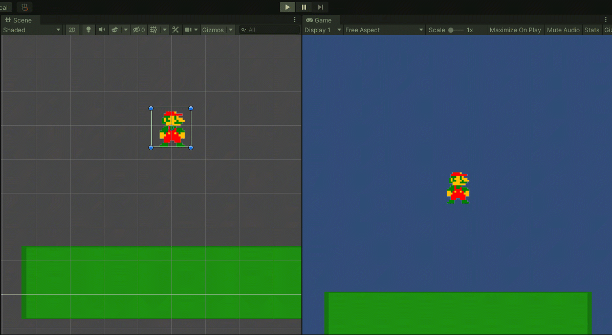

# Mario Activity

This was written for Unity 2020.2x. Versions older than Unity 2020.2 will take more steps to import the sprites.

## Step 1: Create a 2D Unity Project

Open Unity Hub and click on the **NEW** button.

Select 2D from the Templates, name your project file, and choose where you want to save your project folder.


Click **CREATE** and wait...for...ever...

Once your Unity project loads, it will look like this:


Click and drag the Game tab to the right so that it snaps and allows you to see both the Scene and Game windows at the same time.


The Game window is what the player would see.

## Step 2: Add the Assets

Download these assets:



Extract the files and open them in your File Explorer \(outside of Unity\).

In the folder, Images, you should have these:


In Unity, in the Project window, click the Assets folder to open it.

Right-click and create a Sprites folder.


Enter the Sprites folder.


Click and drag your Mario assets/images into the folder. This will create copies of the images in your project folder.


## Step 3: Create the Scene

Click on the Scenes folder in your Project window.


Right-click and create a new scene. I'll call mine, Mario.


Double-click it to open it.


2D objects have a Main Camera object by default.

## Step 4: Add Sprites to the Scene

Right-click in the Hierarchy window to add a 2D Object called a "sprite." I'm using a square sprite to create a platform/ground.


I renamed mine "ground."


It starts off as a white square, let's use the corner vectors to make it larger. Click and drag to reposition it.


Click the _color_ property in the Inspector window in the **Sprite Renderer** component to change the color.


Click and drag your "stand" image from the Project window \(Assets &gt; Sprites\) into the Scene window. Place him a little above the "ground" so we can watch him fall.


Rename the sprite to Mario in the Hierarchy window and resize the sprite to your liking.


Holding SHIFT as you drag will keep him proportional as you resize him.



## Step 5: Make the Sprites Have Borders and Gravity

To make the Mario asset fall, we need to add a **Rigidbody2D** component and a **BoxCollider2D** component.

Click on your Mario asset in the Hierarchy or Scene window.

In your Inspector window, click the **Add Component** button and search for and select those two components.

Once added, the Inspector window will look like this:


The Rigidbody 2D component adds gravity while the Box Collider 2D adds a boundary. By default, the boundary is the edges of the sprite image.

If you play it now, Mario falls right through the ground!



Click on the Ground object in the Hierarchy or Scene window and add a **Box Collider 2D** component to it so the Mario sprite stops at the ground.


Now, Mario lands correctly.



## Step 6: Creating the Script

In the Project window, in the Assets folder, create a folder named "Scripts" and open it.

Right-click and create a new C\# Script.

I will name my script, MarioMove.cs.


After naming it, double-click it to open it in Visual Studio.

## Step 7: Organizing Your Script

Let's start with thinking about what we want Mario to do.

1. Walk/Run
2. Jump

So let's comment out some sections for our variables.

```csharp
using System.Collections;
using System.Collections.Generic;
using UnityEngine;

public class MarioMove : MonoBehaviour
{
    // Walk

    // Jump

    // Start is called before the first frame update
    void Start()
    {
        
    }

    // Update is called once per frame
    void Update()
    {
        
    }
}

```

Let's also create some blank functions to control what happens when Mario does these things.

```csharp
public void Walk()
{

}

public void Jump()
{

}
```

Put these functions after the closing curly bracket `}` for `Update()`, but before the closing curly bracket `}` for the class.

```csharp
using System.Collections;
using System.Collections.Generic;
using UnityEngine;

public class MarioMove : MonoBehaviour
{
    // Walk

    // Jump

    // Start is called before the first frame update
    void Start()
    {
        
    }

    // Update is called once per frame
    void Update()
    {
        
    }

    public void Walk()
    {

    }

    public void Jump()
    {

    }
}
```

## Step 8: Create and Assign Default Variables

Our default variables are what we start with, default to, have available throughout the game, etc.

For this script, I will have variables for the Mario game object \(so I can move him around\) and for the Sprite image it displays - in this case, the standing image.

```csharp
using System.Collections;
using System.Collections.Generic;
using UnityEngine;

public class MarioMove : MonoBehaviour
{
    public GameObject mario;
    public Sprite standingImage;

    // Walk

    // Jump

    // Start is called before the first frame update
    void Start()
    {
        
    }

    // Update is called once per frame
    void Update()
    {
        
    }

    public void Walk()
    {

    }

    public void Jump()
    {

    }
}

```

Save your script and return to Unity.

Click and drag the MarioMove.cs script from your Project folder to the Mario game object in the Hierarchy or Scene windows or add the script through the **Add Component** button in the Inspector window.

It will look like this when it's added:


Click and drag your Mario object from the Hierarchy window or click on the "target" icon on the right of _Mario_ in the component to select from a list.

For the _Standing Image_, click and drag from the Project window your "stand" image from the "Sprites" folder OR use the "target" icon on the right of _Standing Image_ to select from a list.


## Step 9: Moving Mario With Arrow Keys

Go back to your script. Let's make Mario move to the right when the right arrow is pressed and left when the left arrow is pressed.

Under our Walk variables area, let's create and set a `moveSpeed` variable:

```csharp
// Walk
public float moveSpeed = 2;
```

In `Update()`, we can now check for keystrokes and run code based on them:

```csharp
if (Input.GetKey(KeyCode.RightArrow))
{
    mario.transform.position += Vector3.right * moveSpeed * Time.deltaTime;
}

if (Input.GetKey(KeyCode.LeftArrow))
{
    mario.transform.position += Vector3.left * moveSpeed * Time.deltaTime;
}
```

Here, we are using `Input.GetKey()` so that the key inside the parentheses will be checked and be "true" when pressed on every frame it is pressed - great for smooth movement.

`Vector3.right` and `Vector3.left` are both shortcuts for 1 or -1 on the x-axis respectively. This helps keep us from having to write out all three axes.

`Time.deltaTime` helps normalize the speed so that it is consistent at different computer speeds.

Full code so far:

```csharp
using System.Collections;
using System.Collections.Generic;
using UnityEngine;

public class MarioMove : MonoBehaviour
{
    public GameObject mario;
    public Sprite standingImage;

    // Walk
    public float moveSpeed = 2;

    // Jump

    // Start is called before the first frame update
    void Start()
    {
        
    }

    // Update is called once per frame
    void Update()
    {
        if (Input.GetKey(KeyCode.RightArrow))
        {
            mario.transform.position += Vector3.right * moveSpeed * Time.deltaTime;
        }

        if (Input.GetKey(KeyCode.LeftArrow))
        {
            mario.transform.position += Vector3.left * moveSpeed * Time.deltaTime;
        }
    }

    public void Walk()
    {

    }

    public void Jump()
    {

    }
}
```

Save your script and test in Unity!




You can adjust the Move Speed right in the Inspector window!


Be careful: any changes while in Play Mode will revert back to what it was prior to playing.


## Step 10: Making Mario "Walk"

We can use the countdown technique we used when looking at the looping nature of `Update()` to make "lights" flash or have a duration to create a "walk cycle" that goes through a set of still images to create the visual of movement or animation. We'll complete the walk cycle in the next step.

We can start with changing to an image when Mario is walking.

First, we need to have something tell the computer WHEN and IF Mario is walking. Let's do that with a boolean type variable named `isWalking` and set it to `false` because it starts off not walking.

```csharp
public bool isWalking = false;
```

We want to change the image - the **sprite** - the Mario object will have to a walking image when walking and a standing image when not. We can store these sprites in their own variables:

```csharp
public Sprite walk1;
public Sprite walk2;
public Sprite walk3;
public Sprite walk4;
```

Now, we have to say what to do when walking in the `Update()` function.

```csharp
if (isWalking)
{
    Walk();
}
```

This code says, "If the variable 'isWalking' is true, run the Walk\(\) function."

So let's go to our `Walk()` function and tell the computer to do something. Start with switching to the first walk sprite image.

We can access Mario's sprite through its **Sprite Renderer** component:


In the code, we can get any component with GetComponent&lt;NameOfComponent&gt;\(\) and update a property like it was a variable.

```csharp
public void Walk()
{
    mario.GetComponent<SpriteRenderer>().sprite = walk1;
}
```

Now that we say what to do when it's walking, we have to say somewhere WHEN to turn on \(make `true`\) `isWalking` and when to turn it off \(make `false`\).

We can have `isWalking` turn on/become `true` whenever we are pushing an arrow button to make Mario move by adding to the if statements in the `Update()` function.

```csharp
if (Input.GetKey(KeyCode.RightArrow))
{
    mario.transform.position += Vector3.right * moveSpeed * Time.deltaTime;
    isWalking = true;
}

if (Input.GetKey(KeyCode.LeftArrow))
{
    mario.transform.position += Vector3.left * moveSpeed * Time.deltaTime;
    isWalking = true;
}
```

Well, we turn on `isWalking`, we need to turn it off. The most obvious would be to turn off when the user releases or stops pressing the arrow key. Instead of creating code to look for key releases, let's turn these two if statements into an if/else if/else statement so the default would have `isWalking` turned off \(`false`\). 

```csharp
if (Input.GetKey(KeyCode.RightArrow))
{
    mario.transform.position += Vector3.right * moveSpeed * Time.deltaTime;
    isWalking = true;
}

else if (Input.GetKey(KeyCode.LeftArrow))
{
    mario.transform.position += Vector3.left * moveSpeed * Time.deltaTime;
    isWalking = true;
}

else
{
    isWalking = false;
}
```

One last thing - we say what to do if `isWalking` is true, but not what to do when it is _not_.

Instead of an else statement tacked on to our if statement, let's check for and run code only when `isWalking` is false, using an exclamation point `!` to check for the opposite or whether a variable is false.

```csharp
if (!isWalking)        // Same as if (isWalking == false)
{
    mario.GetComponent<SpriteRenderer>().sprite = standingImage;
}
```

Full code so far:

```csharp
using System.Collections;
using System.Collections.Generic;
using UnityEngine;

public class MarioMove : MonoBehaviour
{
    public GameObject mario;
    public Sprite standingImage;

    // Walk
    public float moveSpeed = 2;
    public bool isWalking = false;
    public Sprite walk1;
    public Sprite walk2;
    public Sprite walk3;
    public Sprite walk4;

    // Jump

    // Start is called before the first frame update
    void Start()
    {
        
    }

    // Update is called once per frame
    void Update()
    {
        if (isWalking)
        {
            Walk();
        }

        if (!isWalking)
        {
            mario.GetComponent<SpriteRenderer>().sprite = standingImage;
        }

        if (Input.GetKey(KeyCode.RightArrow))
        {
            mario.transform.position += Vector3.right * moveSpeed * Time.deltaTime;
            isWalking = true;
        }

        else if (Input.GetKey(KeyCode.LeftArrow))
        {
            mario.transform.position += Vector3.left * moveSpeed * Time.deltaTime;
            isWalking = true;
        }

        else
        {
            isWalking = false;
        }
    }

    public void Walk()
    {
        mario.GetComponent<SpriteRenderer>().sprite = walk1;
    }

    public void Jump()
    {

    }
}
```

Save your script and return to Unity.

This is what the Mario Move component now looks like:


Click and drag the images from the Project window under Assets &gt; Sprites to the Walk 1-4 fields or use the "target" icon on the right of each to choose from a list. **For Walk 4, use the same image as Walk 2.**


Test it!


## Step 11: Completing the Walk Cycle

Go back to your script.

For the walk cycle, we need to keep track of which walk image is currently being shown. We can do that in an integer variable in our walk variables at the top of the script and start it at the first image or zero.

```csharp
public int currentWalkImage = 0;
```

In the `Walk()` function, we can say which image to show based on the number of `currentWalkImage`. To keep it simple, we'll do this with if statements.

```csharp
public void Walk()
{
    if (currentWalkImage == 0)
    {
        mario.GetComponent<SpriteRenderer>().sprite = walk1;
    }

    if (currentWalkImage == 1)
    {
        mario.GetComponent<SpriteRenderer>().sprite = walk2;
    }

    if (currentWalkImage == 2)
    {
        mario.GetComponent<SpriteRenderer>().sprite = walk3;
    }
    if (currentWalkImage == 3)
    {
        mario.GetComponent<SpriteRenderer>().sprite = walk4;
    }
}
```

Now, we need to control WHEN to change the `currentWalkImage` to the next number using a countdown technique.

At the top of the script, add two floating point variables to the Walk variables - one to keep track of the speed of the animation \(how long an image is seen\) and a countdown to control the change to the next image.

```csharp
public float spriteLength = 1;
public float spriteCountdown;
```

For `spriteCountdown`, set in inside the `Start()` function to set it on the first frame.

```csharp
void Start()
{
    spriteCountdown = spriteLength;
}
```

Back to our Walk\(\) function...

As long as Walk\(\) is running, we want the spriteCountdown variable to countdown and do stuff when it hits zero.

```csharp
spriteCountdown -= 1 * Time.deltaTime;
```

Here, we are subtracting 1 from whatever `spriteCountdown` is on that frame with a shortcut `-=`. Multiplying it by `Time.deltaTime` normalizes the speed of the countdown so it's roughly 1 second if the countdown begins at 1.

Now, for the trigger - using an if statement to test when the countdown reaches or goes lower than zero and have it run code \(update the `currentWalkImage`\). We only have four walk images, so we need to add 1 until it gets to the fourth image, then reset to 0.

```csharp
if (spriteCountdown <= 0)
{
    if (currentWalkImage < 3)
    {
        currentWalkImage += 1;
    }
    else
    {
        currentWalkImage = 0;
    }
}
```

We also want to reset the countdown within that countdown if statement.

```csharp
spriteCountdown = spriteLength;
```

Full code so far:

```csharp
using System.Collections;
using System.Collections.Generic;
using UnityEngine;

public class MarioMove : MonoBehaviour
{
    public GameObject mario;
    public Sprite standingImage;

    // Walk
    public float moveSpeed = 2;
    public bool isWalking = false;
    public Sprite walk1;
    public Sprite walk2;
    public Sprite walk3;
    public Sprite walk4;
    public int currentWalkImage = 0;
    public float spriteLength = 1;
    public float spriteCountdown;

    // Jump

    // Start is called before the first frame update
    void Start()
    {
        spriteCountdown = spriteLength;
    }

    // Update is called once per frame
    void Update()
    {
        if (isWalking)
        {
            Walk();
        }

        if (!isWalking)
        {
            mario.GetComponent<SpriteRenderer>().sprite = standingImage;
        }

        if (Input.GetKey(KeyCode.RightArrow))
        {
            mario.transform.position += Vector3.right * moveSpeed * Time.deltaTime;
            isWalking = true;
        }

        else if (Input.GetKey(KeyCode.LeftArrow))
        {
            mario.transform.position += Vector3.left * moveSpeed * Time.deltaTime;
            isWalking = true;
        }

        else
        {
            isWalking = false;
        }
    }

    public void Walk()
    {
        spriteCountdown -= 1 * Time.deltaTime;

        if (spriteCountdown <= 0)
        {
            if (currentWalkImage < 3)
            {
                currentWalkImage += 1;
            }
            else
            {
                currentWalkImage = 0;
            }

            spriteCountdown = spriteLength;
        }

        if (currentWalkImage == 0)
        {
            mario.GetComponent<SpriteRenderer>().sprite = walk1;
        }

        if (currentWalkImage == 1)
        {
            mario.GetComponent<SpriteRenderer>().sprite = walk2;
        }

        if (currentWalkImage == 2)
        {
            mario.GetComponent<SpriteRenderer>().sprite = walk3;
        }
        if (currentWalkImage == 3)
        {
            mario.GetComponent<SpriteRenderer>().sprite = walk4;
        }
    }

    public void Jump()
    {

    }
}

```

Save your script and test it in Unity!


It's slow moving and the animation is suuuuper slow.

I'm going to increase my `moveSpeed` to 4 and decrease my `spriteLength` to 0.1 within the component in the Inspector window.


Way better!

## Step 12: Making Mario Jump

Mario needs to jump now. So we need variables at the top of the script for...

1. Whether Mario is jumping or not - boolean
2. How high he'll jump - floating point
3. What image to show when jumping - Sprite

```csharp
// Jump
public bool isJumping = false;
public float jumpHeight = 300;
public Sprite jumpingImage;
```

`Jump()` will be adding force, so it's a crazy high number as a baseline - 300!

In our `Jump()` function, we can add code to push up Mario. Its Rigidbody2D component that gives it gravity also has a built-in function called `AddForce()`. We can get to that function through the component using `GetComponent<Rigidbody2d>()`.

```csharp
public void Jump()
{
    mario.GetComponent<Rigidbody2D>().AddForce();
}
```

`AddForce()` needs information - which direction to add force - in the parentheses to work. Let's use the shorthand, `Vector3.up` and multiply it by the `jumpHeight`.

```csharp
public void Jump()
{
    mario.GetComponent<Rigidbody2D>().AddForce(Vector3.up * jumpHeight);
}
```

We also want to change the image:

```csharp
public void Jump()
{
    mario.GetComponent<Rigidbody2D>().AddForce(Vector3.up * jumpHeight);
    mario.GetComponent<SpriteRenderer>().sprite = jumpingImage;
}
```

Back in our `Update()` function, we need to tell it when to run the `Jump()` function - with a keystroke and only on the first frame the key is pressed \(`Input.GetKeyDown()`\). 

```csharp
if (Input.GetKeyDown(KeyCode.Space))
{
    Jump();
}
```

This will run only on the first frame the spacebar is pressed.

We can turn on `isJumping` and turn off `isWalking` here, too.

```csharp
if (Input.GetKeyDown(KeyCode.Space))
{
    Jump();
    isJumping = true;
    isWalking = false;
}
```

That means we need to update our if statement that looks at when to change the image to the default standing image.

Add a second condition to the if statement:

```csharp
if (!isWalking && !isJumping)
{
    mario.GetComponent<SpriteRenderer>().sprite = standingImage;
}
```

The `&&` logical operator makes the if statement only run if both tests are "true." This code is asking "Is this true: `isWalking` is `false` AND `isJumping` is `false`."

Full code so far:

```csharp
using System.Collections;
using System.Collections.Generic;
using UnityEngine;

public class MarioMove : MonoBehaviour
{
    public GameObject mario;
    public Sprite standingImage;

    // Walk
    public float moveSpeed = 2;
    public bool isWalking = false;
    public Sprite walk1;
    public Sprite walk2;
    public Sprite walk3;
    public Sprite walk4;
    public int currentWalkImage = 0;
    public float spriteLength = 1;
    public float spriteCountdown;

    // Jump
    public bool isJumping = false;
    public float jumpHeight = 300;
    public Sprite jumpingImage;

    // Start is called before the first frame update
    void Start()
    {
        spriteCountdown = spriteLength;
    }

    // Update is called once per frame
    void Update()
    {
        if (isWalking)
        {
            Walk();
        }

        if (!isWalking && !isJumping)
        {
            mario.GetComponent<SpriteRenderer>().sprite = standingImage;
        }

        if (Input.GetKey(KeyCode.RightArrow))
        {
            mario.transform.position += Vector3.right * moveSpeed * Time.deltaTime;
            isWalking = true;
        }

        else if (Input.GetKey(KeyCode.LeftArrow))
        {
            mario.transform.position += Vector3.left * moveSpeed * Time.deltaTime;
            isWalking = true;
        }

        else
        {
            isWalking = false;
        }

        if (Input.GetKeyDown(KeyCode.Space))
        {
            Jump();
            isJumping = true;
            isWalking = false;
        }
    }

    public void Walk()
    {
        spriteCountdown -= 1 * Time.deltaTime;

        if (spriteCountdown <= 0)
        {
            if (currentWalkImage < 3)
            {
                currentWalkImage += 1;
            }
            else
            {
                currentWalkImage = 0;
            }

            spriteCountdown = spriteLength;
        }

        if (currentWalkImage == 0)
        {
            mario.GetComponent<SpriteRenderer>().sprite = walk1;
        }

        if (currentWalkImage == 1)
        {
            mario.GetComponent<SpriteRenderer>().sprite = walk2;
        }

        if (currentWalkImage == 2)
        {
            mario.GetComponent<SpriteRenderer>().sprite = walk3;
        }
        if (currentWalkImage == 3)
        {
            mario.GetComponent<SpriteRenderer>().sprite = walk4;
        }
    }

    public void Jump()
    {
        mario.GetComponent<Rigidbody2D>().AddForce(Vector3.up * jumpHeight);
        mario.GetComponent<SpriteRenderer>().sprite = jumpingImage;
    }
}

```

Save your script and return to Unity.

Your Mario Move component will now look like this:


Click and drag your jump sprite from the Project window \(in Assets &gt; Sprites\) to the Jumping Image field in the Inspector window or click the "target" icon on the right to choose from a list.


Test it!


We are getting closer!

Let's fix:

1. It doesn't turn off "isJumping"
2. It allows for jumping even in the middle of a jump
3. It does a walking cycle even in the air

Back to the script...

For now, we will have Mario turn off jumping when it hits any other object with a collider - like our ground - by using a built-in function, `OnColliderEnter2D()`. _Enter_ at the end of the function means it only runs on the first frame it recognizes the collision.

At the end of the script, but before/inside the final curly bracket }, put this \(it will start to autofill\):

```csharp
public void OnCollisionEnter2D(Collision2D collision)
{
    
}
```

Here, we can turn off `isJumping` the moment it collides with the ground object.

```csharp
public void OnCollisionEnter2D(Collision2D collision)
{
    isJumping = false;
}
```

This fixes \#1.

Now for \#2:

In the script - in `Jump()`, we can say to add force only when it's not already jumping.

```csharp
public void Jump()
{
    if (!isJumping)
    {
        mario.GetComponent<Rigidbody2D>().AddForce(Vector3.up * jumpHeight);
    }

    mario.GetComponent<SpriteRenderer>().sprite = jumpingImage;
}
```

The code for our spacebar will run `Jump()` before turning `isJumping` to true, so this will only jump once.

For \#3:

In the script that moves our Mario object with arrow keys, check to see if Mario is jumping before making `isWalking` true.

```csharp
if (Input.GetKey(KeyCode.RightArrow))
        {
            mario.transform.position += Vector3.right * moveSpeed * Time.deltaTime;

            if (!isJumping)
            {
                isWalking = true;
            }
        }

        else if (Input.GetKey(KeyCode.LeftArrow))
        {
            mario.transform.position += Vector3.left * moveSpeed * Time.deltaTime;

            if (!isJumping)
            {
                isWalking = true;
            }
        }
```

Full code so far:

```csharp
using System.Collections;
using System.Collections.Generic;
using UnityEngine;

public class MarioMove : MonoBehaviour
{
    public GameObject mario;
    public Sprite standingImage;

    // Walk
    public float moveSpeed = 2;
    public bool isWalking = false;
    public Sprite walk1;
    public Sprite walk2;
    public Sprite walk3;
    public Sprite walk4;
    public int currentWalkImage = 0;
    public float spriteLength = 1;
    public float spriteCountdown;

    // Jump
    public bool isJumping = false;
    public float jumpHeight = 300;
    public Sprite jumpingImage;

    // Start is called before the first frame update
    void Start()
    {
        spriteCountdown = spriteLength;
    }

    // Update is called once per frame
    void Update()
    {
        if (isWalking)
        {
            Walk();
        }

        if (!isWalking && !isJumping)
        {
            mario.GetComponent<SpriteRenderer>().sprite = standingImage;
        }

        if (Input.GetKey(KeyCode.RightArrow))
        {
            mario.transform.position += Vector3.right * moveSpeed * Time.deltaTime;
            
            if (!isJumping)
            {
                isWalking = true;
            }
        }

        else if (Input.GetKey(KeyCode.LeftArrow))
        {
            mario.transform.position += Vector3.left * moveSpeed * Time.deltaTime;
            
            if (!isJumping)
            {
                isWalking = true;
            }
        }

        else
        {
            isWalking = false;
        }

        if (Input.GetKeyDown(KeyCode.Space))
        {
            Jump();
            isJumping = true;
            isWalking = false;
        }
    }

    public void Walk()
    {
        spriteCountdown -= 1 * Time.deltaTime;

        if (spriteCountdown <= 0)
        {
            if (currentWalkImage < 3)
            {
                currentWalkImage += 1;
            }
            else
            {
                currentWalkImage = 0;
            }

            spriteCountdown = spriteLength;
        }

        if (currentWalkImage == 0)
        {
            mario.GetComponent<SpriteRenderer>().sprite = walk1;
        }

        if (currentWalkImage == 1)
        {
            mario.GetComponent<SpriteRenderer>().sprite = walk2;
        }

        if (currentWalkImage == 2)
        {
            mario.GetComponent<SpriteRenderer>().sprite = walk3;
        }
        if (currentWalkImage == 3)
        {
            mario.GetComponent<SpriteRenderer>().sprite = walk4;
        }
    }

    public void Jump()
    {
        if (!isJumping)
        {
            mario.GetComponent<Rigidbody2D>().AddForce(Vector3.up * jumpHeight);
        }

        mario.GetComponent<SpriteRenderer>().sprite = jumpingImage;
    }

    public void OnCollisionEnter2D(Collision2D collision)
    {
        isJumping = false;
    }
}
```

Save your script and test it in Unity!


## Step 13: Changing Directions

It looks a little awkward with Mario always facing right. Let's change it to switch directions when we press the arrow keys.

One of the coolest things about using code to control game objects is that we don't need to have a second set of images for when Mario is looking left. All we need to do is update the width or the local scale on the x-axis by multiplying it by -1. That makes a scale of 1 go to -1 and vice versa.

In your Walk variables, create an integer variable to stand in for a direction. I'll use 0 for left and 1 for right. Mario starts looking right.

```csharp
public int direction = 1;
```

At the end of the script before the final curly bracket `}`, add a new custom script called `ChangeDirection()`.

```csharp
public void ChangeDirection()
{
    
}
```

In that code, we want to update Mario's scale on the x-axis. We can't update `localScale.x` by itself, so we need to give it a `new Vector3` - a set of three floating point numbers, one for each axis. We can have it use the current local scale for these values, multiplying the x-axis value by -1.

```csharp
public void ChangeDirection()
{
    mario.transform.localScale = new Vector3(mario.transform.localScale.x * -1, mario.transform.localScale.y, mario.transform.localScale.z);
}
```

In our code that looks at keystrokes for the arrow keys, we need to check for what direction Mario is currently facing and switch it if it doesn't match the direction we need.

```csharp
if (Input.GetKey(KeyCode.RightArrow))
        {
            mario.transform.position += Vector3.right * moveSpeed * Time.deltaTime;
            isWalking = true;
            
            if (!isJumping)
            {
                isWalking = true;
            }
            
            if (direction == 0)
            {
                ChangeDirection();
                direction = 1;
            }
        }

        else if (Input.GetKey(KeyCode.LeftArrow))
        {
            mario.transform.position += Vector3.left * moveSpeed * Time.deltaTime;
            isWalking = true;
            
            if (!isJumping)
            {
                isWalking = true;
            }
            
            if (direction == 1)
            {
                ChangeDirection();
                direction = 0;
            }
        }
```

Full final code:

```csharp
using System.Collections;
using System.Collections.Generic;
using UnityEngine;

public class MarioMove : MonoBehaviour
{
    public GameObject mario;
    public Sprite standingImage;

    // Walk
    public float moveSpeed = 2;
    public bool isWalking = false;
    public Sprite walk1;
    public Sprite walk2;
    public Sprite walk3;
    public Sprite walk4;
    public int currentWalkImage = 0;
    public float spriteLength = 1;
    public float spriteCountdown;
    public int direction = 1;

    // Jump
    public bool isJumping = false;
    public float jumpHeight = 300;
    public Sprite jumpingImage;

    // Start is called before the first frame update
    void Start()
    {
        spriteCountdown = spriteLength;
    }

    // Update is called once per frame
    void Update()
    {
        if (isWalking)
        {
            Walk();
        }

        if (!isWalking && !isJumping)
        {
            mario.GetComponent<SpriteRenderer>().sprite = standingImage;
        }

        if (Input.GetKey(KeyCode.RightArrow))
        {
            mario.transform.position += Vector3.right * moveSpeed * Time.deltaTime;

            if (!isJumping)
            {
                isWalking = true;
            }

            if (direction == 0)
            {
                ChangeDirection();
                direction = 1;
            }
        }

        else if (Input.GetKey(KeyCode.LeftArrow))
        {
            mario.transform.position += Vector3.left * moveSpeed * Time.deltaTime;

            if (!isJumping)
            {
                isWalking = true;
            }

            if (direction == 1)
            {
                ChangeDirection();
                direction = 0;
            }
        }

        else
        {
            isWalking = false;
        }

        if (Input.GetKeyDown(KeyCode.Space))
        {
            Jump();
            isJumping = true;
            isWalking = false;
        }
    }

    public void Walk()
    {
        spriteCountdown -= 1 * Time.deltaTime;

        if (spriteCountdown <= 0)
        {
            if (currentWalkImage < 3)
            {
                currentWalkImage += 1;
            }
            else
            {
                currentWalkImage = 0;
            }

            spriteCountdown = spriteLength;
        }

        if (currentWalkImage == 0)
        {
            mario.GetComponent<SpriteRenderer>().sprite = walk1;
        }

        if (currentWalkImage == 1)
        {
            mario.GetComponent<SpriteRenderer>().sprite = walk2;
        }

        if (currentWalkImage == 2)
        {
            mario.GetComponent<SpriteRenderer>().sprite = walk3;
        }
        if (currentWalkImage == 3)
        {
            mario.GetComponent<SpriteRenderer>().sprite = walk4;
        }
    }

    public void Jump()
    {
        if (!isJumping)
        {
            mario.GetComponent<Rigidbody2D>().AddForce(Vector3.up * jumpHeight);
        }

        mario.GetComponent<SpriteRenderer>().sprite = jumpingImage;
    }

    public void OnCollisionEnter2D(Collision2D collision)
    {
        isJumping = false;
    }

    public void ChangeDirection()
    {
        mario.transform.localScale = new Vector3(mario.transform.localScale.x * -1, mario.transform.localScale.y, mario.transform.localScale.z);
    }
}

```

Save your script and test it in Unity!


## Step 14: Add Sound

In Unity, create a folder in your Assets folder in the Project window and name it Audio.


Just as you click and dragged the image files from the MarioAssets folder, click and drag the audio files from the Audio file.


Click on your Mario object in your Hierarchy or Scene windows.

Click the **Add Component** button in the Inspector window. Search for and add the **Audio Source** component.


Click and drag the smw\_jump.wav file from the Project window \(in Assets &gt; Audio\) to the field for AudioClip OR click on the "target" icon to the right of AudioClip to select from a list.


Click the checkbox next to _Play on Awake_ to turn it off.


Go to your script.

Create a variable near the top to hold the reference to the specific AudioSource component.

```csharp
public AudioSource jumpSound;
```

In the `Jump()` function, have the `jumpSound` play when it jumps.

```csharp
public void Jump()
{
    if (!isJumping)
    {
        mario.GetComponent<Rigidbody2D>().AddForce(Vector3.up * jumpHeight);
        jumpSound.Play();
    }

    mario.GetComponent<SpriteRenderer>().sprite = jumpingImage;
}
```

Save your script and return to Unity.

Your Mario Move component will now look like this:


Click and drag your Mario object to the _Jump Sound_ field OR click on the "target" icon to the right of _Jump Sound_ to select from a list. We use the Mario object here because the sound is attached to it.


Test it! It should now have sound!

