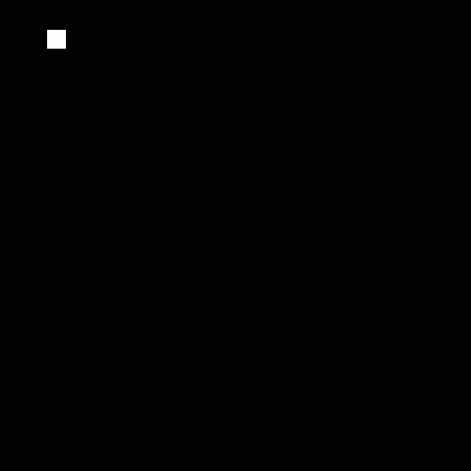
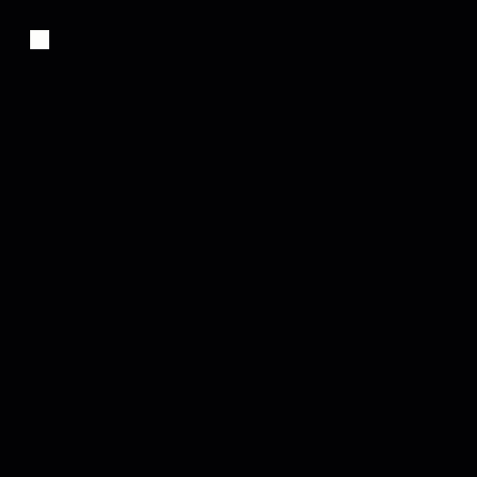
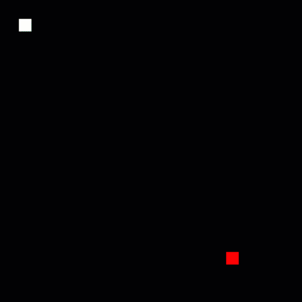
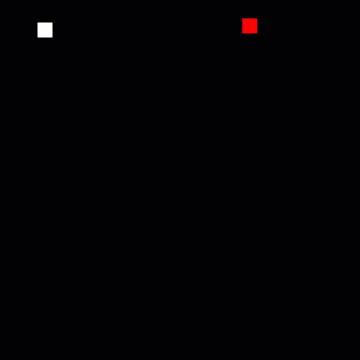
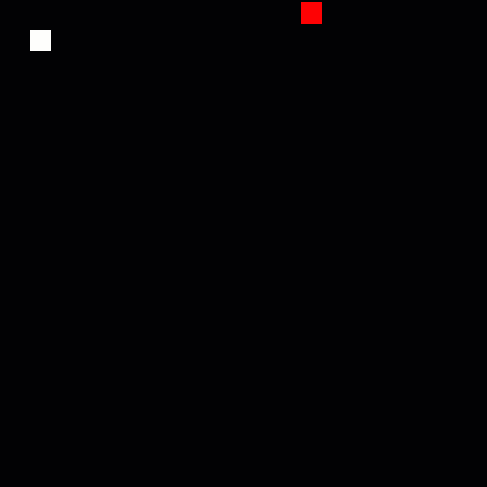

# Snake \(Processing\)

This is the beginning of a snake game using a combination of elements you have learned about in class. This activity uses Processing and all code should allow you to copy and paste.

## Step 1: Create the Play Space and Player

Create a 600 x 600 size canvas that has a black background and a 25 x 25 square at coordinates \(50, 50\).

```java
void setup() {
  size(600,600);    // 600 x 600 pixel canvas
  rectMode(CENTER);    // Puts the pivot of rectangles and squares in the center
}

void draw() {
  background(0);    // Black background
  square(50, 50, 25);  // 25 x 25 pixel square at coords (50, 50)
}
```

Let's look at the functions already used:

**`setup()`** and **`draw()`**

For each of these functions, they start with "void" meaning there's no **return** value or output. They exist to just run code. The parentheses are empty meaning there are no arguments or input needed for the function to run correctly. Here, we are creating these functions and Processing knows these specific functions have specific actions \(setup runs once, draw runs on every frame\).

**`size()`** or **`size(float width, float height)`**

Here, we are "calling" or "invoking" a built-in function. The two values we provide in the parentheses are "arguments" or the input for the width and height. Without these values, the function will not work. However, there is a default size for Processing.

**`rectMode()`** - takes a mode to know how to handle rectangles and squares

**`background()`** or   
**`background(float grayscale)`** or   
**`background(float red, float green, float blue)`** or   
**`background(float red, float green, float blue, float alpha)`**

This is a good example of how four different functions can have the same name and run different code based on the number of arguments. One argument will provide the grayscale or the equivalent of having all three colors the same value. The ones with one or three arguments all have a default alpha of 1. If you use all four arguments, the colors are 0-255 and the alpha is 0-1.

**`square()`** or **`square(float x, float y, float size)`**

This is actually more like an object in Processing, but it can be seen as a function as well with three arguments - x coordinate, y coordinate, and the size.

## Step 2: Move Values to Variables

```java
float x = 50;
float y = 50;
float size = 25;

void setup() {
  size(600,600);    // 600 x 600 pixel canvas
  rectMode(CENTER);    // Puts the pivot of rectangles and squares in the center
}

void draw() {
  background(0);    // Black background
  square(x, y, size);  // 25 x 25 pixel square at coords (50, 50)
}
```

Output:


## Step 3: Add Movement

In the past, we've just added a speed variable to one of the coordinates:

```java
float x = 50;
float y = 50;
float size = 25;
float speed = 1;

void setup() {
  size(600,600);    
  rectMode(CENTER);    
}

void draw() {
  background(0);    
  
  x += speed;
  
  // Draw your squares last
  square(x, y, size);
}
```

However, this creates a smooth movement:



We want it to be jumpier like the old snake game, so let's add a delay between the movements.

This delay is basically a timer that resets at zero and triggers a set of code at zero, leaving the delay as long as the delay reset in frames.

Create a `delay` and `delayReset` variable. Don't give delay an initial value.

```java
float delay;
float delayReset = 30;
```

Set `delay` to the `delayReset` value in `setup()`

```java
void setup() {
  size(600,600);    
  rectMode(CENTER);   
  delay = delayReset;
}
```

Have `delay` count down and have the square's x value update only when zero. Don't forget to always reset the `delay` at the end of the delay if statement.

Instead of speed, have x increase by the size of the square.

```java
void draw() {
  background(0);    
  
  // counts down delay
  delay -= 1;
  
  // Run the code at zero
  if (delay <= 0) {
    x += size;
    
    
    // Reset the delay
    delay = delayReset;
  }
  
  // Draw your squares last
  square(x, y, size);
}
```

Output when played:



## Step 4: Add Other Directions and Keyboard Input

To help organize values, let's have an integer variable keep track of the direction the square is headed. That way, we only have to update the value when we check the keypress and check the value to say which direction to go.

```java
int direction = 0;     // 0 = right, 1 = down, 2 = left, 3 = up
```

Check the `direction` in the delay if statement and add code to update the appropriate coordinate.

```java
...

delay -= 1;
  
if (delay <= 0) {
  
  // If going right
  if (direction == 0) {
    x += size;
  }
  
  // If going down
  else if (direction == 1) {
    y += size;
  }
  
  // If going left
  else if (direction == 2) {
    x -= size;
  }
  
  // If going up
  else {
    y -= size;
  }
  
  
  delay = delayReset;
}

...
```

Add the **`keyPressed()`** function. Like `setup()` and `draw()`, you are creating a function, but Processing handles the specifically named function to provide information. The one we make will not have a return value or take any arguments.

```java
void keyPressed() {
  
}
```

Check for the arrow buttons using keycodes and update the direction. This way, the direction updates when the user presses the button.

```java
void keyPressed() {
  if (keyCode == RIGHT) {
    direction = 0;
  }
  
  if (keyCode == DOWN) {
    direction = 1;
  }
  
  if (keyCode == LEFT) {
    direction = 2;
  }
  
  if (keyCode == UP) {
    direction = 3;
  }
}
```

Full code so far:

```java
float x = 50;
float y = 50;
float size = 25;

float delay;
float delayReset = 30;

int direction = 0;     // 0 = right, 1 = down, 2 = left, 3 = up

void setup() {
  size(600,600);    
  rectMode(CENTER);   
  delay = delayReset;
}

void draw() {
  background(0);    
  
  delay -= 1;
  
  if (delay <= 0) {
    
    // If going right
    if (direction == 0) {
      x += size;
    }
    
    // If going down
    else if (direction == 1) {
      y += size;
    }
    
    // If going left
    else if (direction == 2) {
      x -= size;
    }
    
    // If going up
    else {
      y -= size;
    }
    
    
    delay = delayReset;
  }
  
  square(x, y, size);
}

void keyPressed() {
  if (keyCode == RIGHT) {
    direction = 0;
  }
  
  if (keyCode == DOWN) {
    direction = 1;
  }
  
  if (keyCode == LEFT) {
    direction = 2;
  }
  
  if (keyCode == UP) {
    direction = 3;
  }
}
```

Output when played and pressing arrow keys:


## Step 5: Add a Target

Add another square as a target with variables to hold its x and y coordinates \(but don't set them!\). Let's also make the player white and the target red.

```java
float targetX;
float targetY;
```

```java
...

// Player
stroke(255);
fill(255);    // White
square(x, y, size);

// Target
stroke(255, 0, 0);
fill(255, 0, 0);    // Red
square(targetX, targetY, size);

...
```

We want to set the target coordinates to be random when the game starts and whenever the player touches it. To make it easier to reset often, let's make a function to handle it.

```java
void resetTarget() {
  
  // size/2 offsets the target so it stays within the canvas
  float offset = size/2;
  
  targetX = random(0 + offset, width - offset);
  targetY = random(0 + offset, height - offset);
}
```

It doesn't need to output any info and no information is needed since `size` is a "global" variable \(listed at the top of the script\). The variable **`offset`** here is an example of a "local" variable - created and only usable within this function.

Now, call this function in the `setup()` function so the target has a start location.

```java
void setup() {
  size(600,600);    
  rectMode(CENTER);   
  delay = delayReset;
  resetTarget();
}
```

Output when played:



## Step 6: Target Interaction

Using a technique to determine the edges of a square, let's create a function that takes in information about the location of the player square and determines if it's interacting with the target. It will simply return `true` if it is and `false` if it is not.

```java
boolean touchingTarget(float playerX, float playerY) {
  float offset = size/2;

  if (playerX + offset >= targetX - offset &&
      playerX - offset <= targetX + offset &&
      playerY + offset >= targetY - offset &&
      playerY - offset <= targetY + offset) {
        
    // If touching, return/output true
    
    return true;
  }
  else {
    
    // otherwise, return/output false
    return false;
  }
}
```

`playerX` and `playerY` are parameters here - needed information for the function to run. The information given as _arguments_ should match the data types and `playerX` and `playerY` serve as temporary variables within the function.

Now, we can use it in the `draw()` function to check if the player is touching the target and when it is, the target coordinates update.

```java
if (touchingTarget(x, y) == true) {
    resetTarget();
}
```

Full code so far:

```java
float x = 50;
float y = 50;
float size = 25;

float targetX;
float targetY;

float delay;
float delayReset = 30;

int direction = 0;     // 0 = right, 1 = down, 2 = left, 3 = up

void setup() {
  size(600,600);    
  rectMode(CENTER);   
  delay = delayReset;
  resetTarget();
}

void draw() {
  background(0);    
  
  delay -= 1;
  
  if (delay <= 0) {
    
    // If going right
    if (direction == 0) {
      x += size;
    }
    
    // If going down
    else if (direction == 1) {
      y += size;
    }
    
    // If going left
    else if (direction == 2) {
      x -= size;
    }
    
    // If going up
    else {
      y -= size;
    }
    
    
    delay = delayReset;
  }
  
  if (touchingTarget(x, y) == true) {
    resetTarget();
  }
  
  // Player
  stroke(255);
  fill(255);    // White
  square(x, y, size);
  
  // Target
  stroke(255, 0, 0);
  fill(255, 0, 0);    // Red
  square(targetX, targetY, size);
  
}

void keyPressed() {
  if (keyCode == RIGHT) {
    direction = 0;
  }
  
  if (keyCode == DOWN) {
    direction = 1;
  }
  
  if (keyCode == LEFT) {
    direction = 2;
  }
  
  if (keyCode == UP) {
    direction = 3;
  }
}

void resetTarget() {
  
  // size/2 offsets the target so it stays within the canvas
  float offset = size/2;
  
  targetX = random(0 + offset, width - offset);
  targetY = random(0 + offset, height - offset);
}

boolean touchingTarget(float playerX, float playerY) {
  float offset = size/2;

  if (playerX + offset >= targetX - offset &&
      playerX - offset <= targetX + offset &&
      playerY + offset >= targetY - offset &&
      playerY - offset <= targetY + offset) {
        
    // If touching, return/output true
    
    return true;
  }
  else {
    
    // otherwise, return/output false
    return false;
  }
}
```

Output when played:



## Step 7: Making It Snake

When the player square hits the target, we want it to add a square to the player's body. As the player goes around, the longer snake tails should appear to snake around. This can be done by having the last square update to the second to last and so on until the first/main square gets told which direction to go.

Let's first set up `x` and `y` to be arrays so we can have multiple squares to loop through.

```java
float[] x = { 50 };
float[] y = { 50 };
```

In our if statements, update `x` and `y` to `x[0]` and `y[0]`. We will be changing the direction of the front square only.

```java
void draw() {
  background(0);    
  
  delay -= 1;
  
  if (delay <= 0) {
    
    // If going right
    if (direction == 0) {
      x[0] += size;
    }
    
    // If going down
    else if (direction == 1) {
      y[0] += size;
    }
    
    // If going left
    else if (direction == 2) {
      x[0] -= size;
    }
    
    // If going up
    else {
      y[0] -= size;
    }
    
    
    delay = delayReset;
  }
  
  if (touchingTarget(x[0], y[0]) == true) {
    resetTarget();
  }
  
  // Player
  stroke(255);
  fill(255);    // White
  square(x[0], y[0], size);
  
  // Target
  stroke(255, 0, 0);
  fill(255, 0, 0);    // Red
  square(targetX, targetY, size);
  
}
```

Now, we want to add the current value of the last square in the snake as the next value to add a square to the snake.

```java
...

if (touchingTarget(x[0], y[0]) == true) {
    x = append(x, x[0]);
    y = append(y, y[0]);
    resetTarget();
}

...
```

To see the squares, we need to draw them with a **loop** toward the end of `draw()`

This replaces the player square.

```java
for (int i = 0; i < x.length; i++) {
    square(x[i], y[i], size);
}
```

Now, we should update the snake using a loop before the first square changes direction or position. Remember: We are starting with the last square and updating each one in reverse order.

```java
for (int i = x.length - 1; i > 0; i--) {
    x[i] = x[i - 1];
    y[i] = y[i - 1];
}
```

## Full Code

```java
float[] x = { 50 };
float[] y = { 50 };
float size = 25;

float targetX;
float targetY;

float delay;
float delayReset = 30;

int direction = 0;     // 0 = right, 1 = down, 2 = left, 3 = up

void setup() {
  size(600,600);    
  rectMode(CENTER);   
  delay = delayReset;
  resetTarget();
}

void draw() {
  background(0);    
  
  delay -= 1;
  
  if (delay <= 0) {
    
    for (int i = x.length - 1; i > 0; i--) {
      x[i] = x[i - 1];
      y[i] = y[i - 1];
    }
    
    // If going right
    if (direction == 0) {
      x[0] += size;
    }
    
    // If going down
    else if (direction == 1) {
      y[0] += size;
    }
    
    // If going left
    else if (direction == 2) {
      x[0] -= size;
    }
    
    // If going up
    else {
      y[0] -= size;
    }
    
    
    delay = delayReset;
  }
  
  if (touchingTarget(x[0], y[0]) == true) {
    x = append(x, x[0]);
    y = append(y, y[0]);
    resetTarget();
  }
  
  // Player
  stroke(255);
  fill(255);    // White
  
  for (int i = 0; i < x.length; i++) {
    square(x[i], y[i], size);
  }
  
  // Target
  stroke(255, 0, 0);
  fill(255, 0, 0);    // Red
  square(targetX, targetY, size);
  
}

void keyPressed() {
  if (keyCode == RIGHT) {
    direction = 0;
  }
  
  if (keyCode == DOWN) {
    direction = 1;
  }
  
  if (keyCode == LEFT) {
    direction = 2;
  }
  
  if (keyCode == UP) {
    direction = 3;
  }
}

void resetTarget() {
  
  // size/2 offsets the target so it stays within the canvas
  float offset = size/2;
  
  targetX = random(0 + offset, width - offset);
  targetY = random(0 + offset, height - offset);
}

boolean touchingTarget(float playerX, float playerY) {
  float offset = size/2;

  if (playerX + offset >= targetX - offset &&
      playerX - offset <= targetX + offset &&
      playerY + offset >= targetY - offset &&
      playerY - offset <= targetY + offset) {
        
    // If touching, return/output true
    
    return true;
  }
  else {
    
    // otherwise, return/output false
    return false;
  }
}
```

Output when played at 5 times the speed:



## Your Turn!

This is just the beginning - see if you can code boundaries to show "Game Over" when the player hits the edge of the canvas or its own tail. Also, see if you can code the target to not appear on the snake.

This is all optional, of course.

