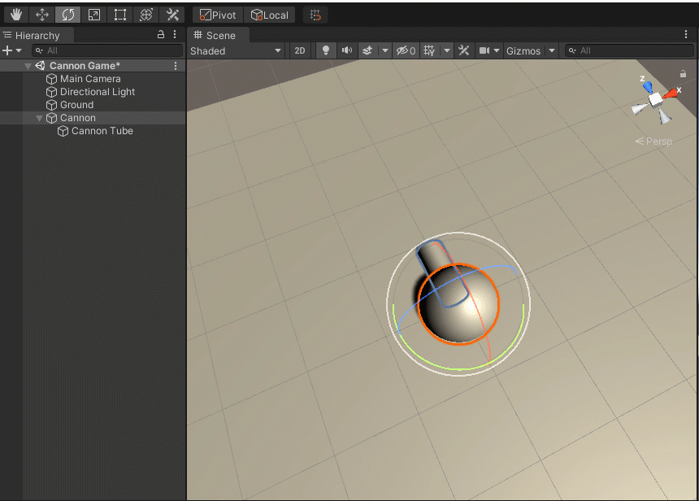

# Cannon Game \(Unity\)

This activity looks at creating and using prefabs. It uses Unity 2020.2 and all code should allow you to copy and paste.

## Step 1: Create a Scene

Open Unity and create a scene by right-clicking in the Project window and selecting **Create &gt; Scene**.


Give it a name - I named mine "Cannon Game" - and press ENTER or RETURN to confirm.


Double-click the scene and it will open.

By default, the scene is empty except for Main Camera and Directional Light objects.


## Step 2: Create a Cannon

We'll start with a ground plane, which is simply a plane named "ground."

Right-click in the Hierarchy window and select **3D Object &gt; Plane**.


Name the plane object _Ground_:


Select the Ground object. In the Inspector window, right-click on the Transform component and select **Reset** to place the plane at the origin.


In the Hierarchy window, click a blank area to deselect any objects.

Right-click and select **3D Object &gt; Sphere**. This will be our cannon base.


Rename the sphere to Cannon.


Just like the plane, select the sphere object and put it at the scene origin by right-clicking on the Transform component in the Inspector window and selecting **Reset**.


You should now have something that looks a little like this:


Let's add a cylinder to be our cannon tube. Right-click in the Hierarchy window and select **3D Object &gt; Cylinder**.


Rename the cylinder to Cannon Tube.


Reset the Cannon Tube to the origin just like the last two objects.


Use the **Scale Tool** on the top left to make the cylinder smaller and longer. 


Click on the center white cube that appears when the Scale Tool is on and drag to the left to make it smaller on all axes. 


Then, click on the green vector and drag upward to make it longer along the Y-axis.


Use the **Rotate Tool** or type in the rotation X coordinate in the Inspector window to 90.


Use the **Move Tool** to move the Cannon Tube into place. You might need to use the **Scale Tool** to make it a good size.


Now, we want the Cannon Tube to rotate with the Cannon object. The best way to do this is to make the Cannon Tube a child object of the Cannon. 

In the Hierarchy window, click and drag the Cannon Tube object onto the Cannon object. The Cannon Tube object should now be indented and the Cannon object will have a triangle on the left allowing for opening and collapsing the list of children under it.


Now, if you rotate the Cannon object, the Cannon Tube follows.


Make sure you have it set to **Pivot** at the top and NOT Center. See image below.





Use the Move Tool to move the Cannon back toward the camera. Select the Main Camera in the Hierarchy window and use the Move and Rotate tools to have a better view of the game.


## Step 3: Create a Cannon Ball

Create a sphere.


Rename it Cannon Ball.


Instead of resetting, we can have the Cannon Ball move to where the center of the Cannon Tube is. Since child objects have the Transform values in relation to their parent object, we need to first add the Cannon Ball to the Cannon object as a child. In the Hierarchy window, click and drag the Cannon Ball object on top of the Cannon object. It should appear indented.


Select the Cannon Tube object to bring up its components in the Inspector window.

Right-click on the word "Position" in the Transform component and select **Copy**.


Then, select the Cannon Ball object in the Hierarchy window to bring up its components in the Inspector window.

Right-click on the word "Position" in the Transform component and select **Paste**.


Use the Scale Tool to scale down the Cannon Ball to be smaller than the tube. Click and drag left on the white center cube that appears when the Scale Tool is turned on.


## Step 4: Make the Cannon Ball Move

All we want the cannon balls to do is move forward until they hit something. Let's make a script!

Create a C\# script. In the Project window, right-click and select **Create &gt; C\# Script**.


Name it CannonBallBehavior.


Double-click the script to open it in Visual Studio.

We will be adding this script to the cannon ball, so any reference to the transform, tag, etc. will be for whatever object the script is attached to.

For movement, it's good to have a `speed` modifier variable to make it easy to update later within Unity.

Put this variable before `Start()`, but inside the class. I'm initializing it to 5, but you can change it in Unity later.

```csharp
public float speed = 5;
```

Inside the `Update()` function, we want the cannon ball to go forward on every frame. Here, we use `Translate()` instead of updating the `position` because `Translate()` uses the direction from the object while `position` uses the overall direction of the scene.

```csharp
// The cannon ball will continuously move forward
transform.Translate(Vector3.forward * Time.deltaTime * speed);
```

Full Code:

```csharp
using System.Collections;
using System.Collections.Generic;
using UnityEngine;

public class CannonBallBehavior : MonoBehaviour
{
    public float speed = 5;

    // Start is called before the first frame update
    void Start()
    {
        
    }

    // Update is called once per frame
    void Update()
    {
        // The cannon ball will continuously move forward
        transform.Translate(Vector3.forward * Time.deltaTime * speed);
    }
}

```

