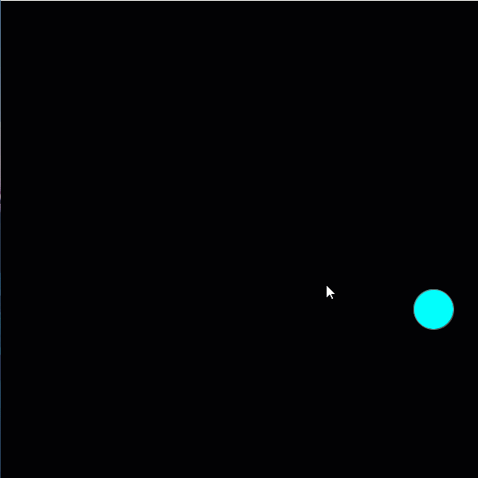
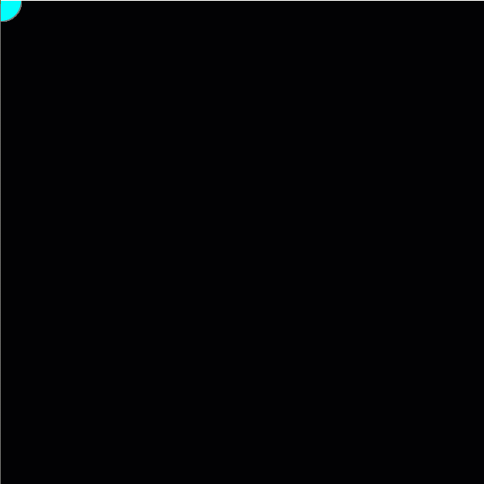
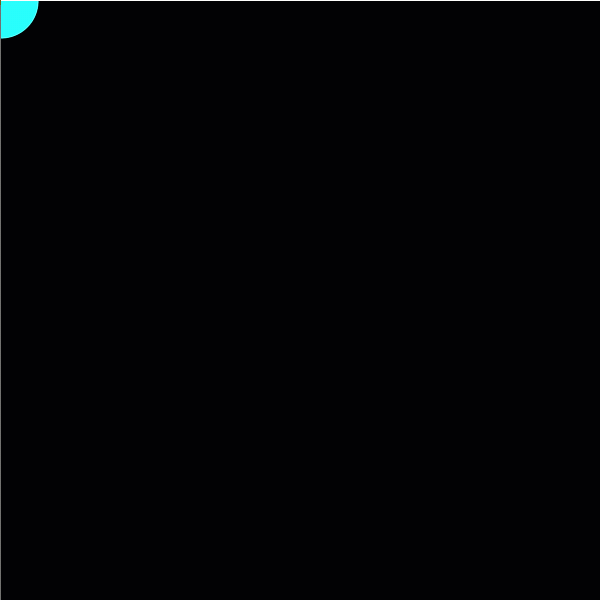
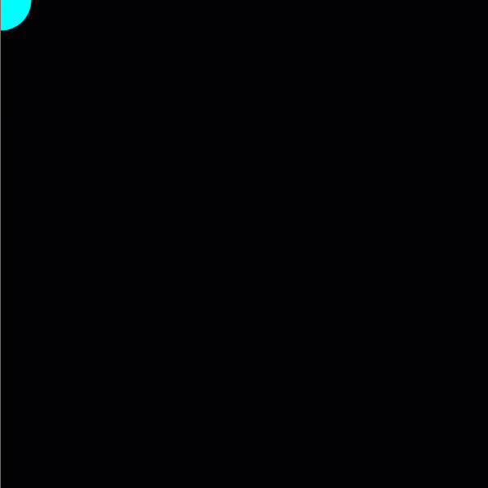
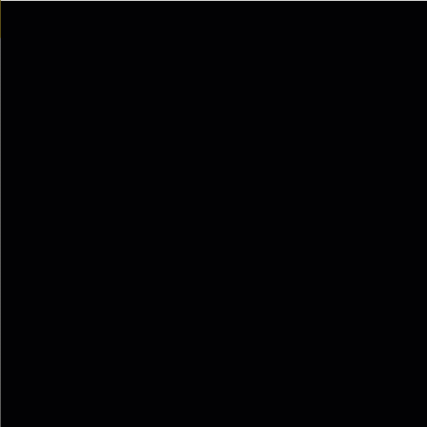

# Monday - Getting Blobby

The steps below walk you through the Processing activity we did during Monday of Week 2. All code should allow you to copy and paste.

## Step 1: Create a Canvas

**Remember:** 

* `setup()` runs once on the first frame, `draw()` runs once per frame until it's stopped
* Think of blocks of code like packages:
  * Any opening parenthesis, curly bracket, and quotation mark need a closing one
  * Close the blocks within before the containing blocks
* End lines of code with a semicolon

Use the **size\(width, height\)** function within the `{ }` of `setup()`

```java
void setup() { 
  size(600, 600);
}

void draw() {
  
}
```

Looks like:


When no background color is provided in the code, this is the gray it will default to.

## Step 2: Create a Shape

Use the 2D Primitives section in Processing.org's Reference to see what's available and what information a shape needs: [https://processing.org/reference/](https://processing.org/reference/)

Here, I'll use **circle\(x-position, y-position, diameter\)**

```java
void setup() { 
  size(600, 600);
}

void draw() {
  circle(300, 300, 50);
}
```

Looks like:


The default color for the stroke is black \(0,0,0\) and the default color for fill is white \(255, 255, 255\).

## Step 3: Add Color

Color is handled in Processing by default as red, green, and blue values ranging from 0 \(no color\) to 255 \(most saturated color\). All colors are a combination of these values. If you only put in one value, Processing assumes you want all three values to be the **same number**, making the color **a shade of gray**.


There is a fourth value we did not cover called "alpha," which is also the color's opacity. It ranges from 0-1 with 0 making it **invisible/transparent** and 1 being completely visible.


To change the color of a shape, it needs to be stated before drawing the shape. It's like telling the artist, "Here is your paint. Now, paint this..."

Use stroke\(red, green, blue\) and fill\(red, green, blue\) to set the color for the stroke and fill.


Use `noStroke()` or `noFill()` without any values to have the stroke or fill removed.


Here, I'll use a black background, a cyan fill, and a dark gray stroke.

```java
void setup() { 
  size(600, 600);
}

void draw() {
  background(0);
  stroke(115);
  fill(0, 255, 255);
  circle(300, 300, 50);
}
```

Looks like:


## Step 4: Using Mouse Coordinates

In Processing, there are built-in variables called "mouseX" and "mouseY" that provide the value of the x-position and the y-position of the cursor while it is within the canvas. This value is updated every frame when put in the `draw()` block.

Let's use `mouseX` and `mouseY` instead of coordinates.

```java
void setup() { 
  size(600, 600);
}

void draw() {
  background(0);
  stroke(115);
  fill(0, 255, 255);
  circle(mouseX, mouseY, 50);
}
```

Looks like:



For each frame, the program is drawing a black background, then a cyan circle with a gray outline/stroke.

## Step 5: Draw the Background Only Once

Let's move the background color to the `setup()` block so it is only drawn once and the circle is drawn repeatedly.

```java
void setup() { 
  size(600, 600);
  background(0);
}

void draw() {
  stroke(115);
  fill(0, 255, 255);
  circle(mouseX, mouseY, 50);
}
```

Looks like:



## Step 6: Remove the Stroke

Removing the stroke will make the shape appear to blend/blur together.

Let's use `noStroke()` to remove the outline.

```java
void setup() { 
  size(600, 600);
  background(0);
}

void draw() {
  noStroke();
  fill(0, 255, 255);
  circle(mouseX, mouseY, 50);
}
```

Looks like:


## Step 7: Add Some Randomness to Size

**random\(min, max\)** is a common function that takes a minimum number and a maximum number and provides a "random" number between them.

Let's use it first on the size of the circle, making the diameter somewhere between 1 and 75 pixels.

```java
void setup() { 
  size(600, 600);
  background(0);
}

void draw() {
  noStroke();
  fill(0, 255, 255);
  circle(mouseX, mouseY, random(1, 75));
}
```

Looks like:


## Step 8: Add Randomness to the Red Values

Let's add a random value between 0 and 255 to the red values of the fill color:

```java
void setup() { 
  size(600, 600);
  background(0);
}

void draw() {
  noStroke();
  fill(random(0, 255), 255, 255);
  circle(mouseX, mouseY, random(1, 75));
}
```

Looks like:



Since both green and blue values are at their maximum, increases in the red value bring the color closer to white \(255, 255, 255\).

## Step 9: Add More Randomness

Let's make all the color values random!

```java
void setup() { 
  size(600, 600);
  background(0);
}

void draw() {
  noStroke();
  fill(random(0, 255), random(0, 255), random(0, 255));
  circle(mouseX, mouseY, random(1, 75));
}
```

Looks like:



## Step 10: Using a Variable

This is jumping ahead, but let's make the speed in which we move the mouse on the X-axis to determine the size of the circle.

What's a quick way of determining speed? Speed really is the amount of time it takes for an object to change. In this case, we want to change the size of the circle based on how much change happened between two frames. 

To record/hold a value to use later, we use **variables**. Variables are similar to reusable labels or nicknames that stand for specified information.

mouseX is updated at the beginning of each frame, so we can't use it by itself. Here, we will "declare" a variable called `lastXPosition` to hold the information of one frame's mouseX information to use in the next frame. 

"float" is used here to tell Processing the type of information it will have. We'll cover this next week.

The single equals sign = is a way of "assigning" or "setting" the value of a variable. So `lastXPosition = 0` means "I want lastXPosition to be 0."


It is good practice to have a starting or "initial" value to avoid errors.


Put variables that will be used for the project before and outside of the setup\(\) and draw\(\) blocks. We want these to be accessed outside of those restrictions.

To declare a variable, use this syntax:  
_`type`_ `nameOfVariable =` _`initialValue`_`;`

```java
float lastXPosition = 0;
```

Once you create a variable, you can update it within the `draw()` block:

```java
lastXPosition = mouseX;
```


You do not need the type of variable when you are updating it.



Updating variables to hold values that change like `mouseX` are best put at the end.


To determine the speed, we will subtract the last frame's `mouseX` from the current one.

That looks like this:

```java
mouseX - lastXPosition
```

However, this could give negative values. Let's use a built-in math function for "absolute power" or **abs\(value\)** to make the value positive.

That looks like this:

```java
abs(mouseX - lastXPosition)
```

Now that we have what we need to get a value for the diameter, let's use it in the circle code:

```java
float lastXPosition = 0;

void setup() { 
  size(600, 600);
  background(0);
}

void draw() {
  noStroke();
  fill(random(0, 255), random(0, 255), random(0, 255));
  circle(mouseX, mouseY, abs(mouseX - lastXPosition));
  lastXPosition = mouseX;
}
```

Looks like:



