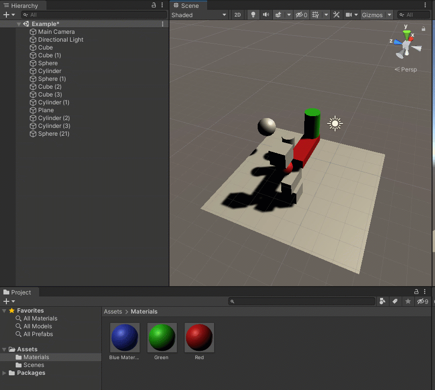

# Tuesday Unity Activity Notes

The activity we did was to get you practicing a little more with the **Translate**, **Rotate**, and **Scale** properties in Unity - all controlled by the **Transform** component \(a built-in script\) in the **Inspector** tab.

The Inspector tab gives you a visual representation of a text script. The three coordinates - X, Y, and Z are all **floating point** numbers \(precision numbers that have a decimal point\). Since it is a "float," as you move or click and drag over the letter to watch the numbers change, they change in a more precise range. On Friday, we will see the difference when we create integers \(whole numbers\) instead.

For a more in-depth look at using Translate, Rotate, and Scale, go here:

[https://hopemoore.gitbook.io/unity-basics/translate-rotate-and-scale/intro-to-transforms](https://hopemoore.gitbook.io/unity-basics/translate-rotate-and-scale/intro-to-transforms)

## Move / Translate 

**Unity Shortcut:** W key

**Move Button:**

Your object will appear to have **arrows**:

## Rotate

**Unity Shortcut:** E key

**Rotate Button:**

Your object will appear to have **circles** or **curves**:

## Scale

**Unity Shortcut:** R key

**Scale Button:**

 Your object will appear to have **blocks** at the end of lines:

## Rigidbody Component

By default, objects will not move when the game is played. The objects can also overlap. 

Adding a **Rigidbody** component will give the object simulated gravity and will use the object's **Collider** component to know where the edges of the objects are. This makes overlapping items with this component explode! It also allows objects to fall and affect those around them.

Add a built-in component through the **Inspector** window:

Click the **Add Component** button.

Use the dropdown menu items to navigate to Physics &gt; Rigidbody OR use the search and start typing the name of the component to find it:

Click on the component to add it and it will appear in the Inspector window:

## Creating a Material

Materials are separate, REUSABLE "objects" \(called **Assets**\) in Unity that you create and then add to other game objects in your scene. 

### **Step 1: Create a Material**

Your **Project** window is a visual representation of your project folder. It shows you your files in your **Assets** folder.

Right-click in your Project window and select Create &gt; Material

This will create a new material, which you can name.

This name can include spaces.

I named this "Blue Materia." \(Yes, that was an accident and I didn't feel like changing it for this page.\)

### **Step 2: Modify a Material**

Once selected, the properties of the material will appear in the **Inspector** window:

Here, you can change different aspects of the material. We'll just change the color here by clicking on the white square next to "Albedo."

Click first on the **Hue** \(color\) in the circle, then on the square to choose your **Saturation** \(intensity\) and **Value** \(brightness\) of that color.

Hit the ENTER key or close the color wheel popup. This will update the material.

### Step 3: Adding a Material to an Object

Unity's best feature is its click-and-drag capability. To add your material to an object in your scene, click and drag your material from your **Project** window to the object in your **Scene** window OR **Hierarchy** window.

When it has been added, not only will you be able to see it update in the Scene window, but you can also see the Material component update at the bottom of the **Inspector** window.


Remember: When you update the properties of an asset in the **Project** window, it updates it for ALL objects the asset is added to.


