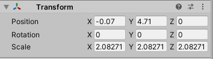
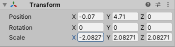
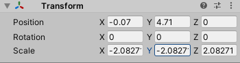
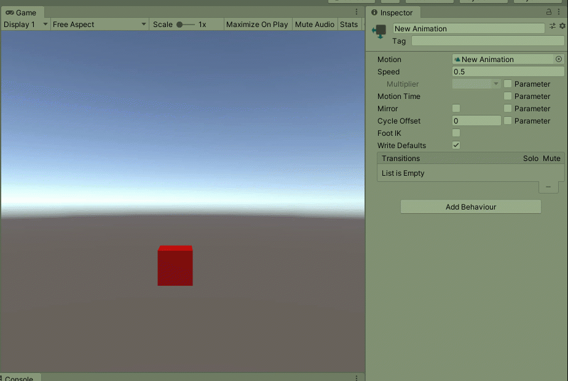

# Power of Negative 1

## Flipping Images

There will be times when you just want an image or a sprite to flip horizontally. Instead of creating another version of the image, multiply the x-axis by negative 1.

Multiple the first value \(x-axis\) by -1...

Additionally, if you were to multiply by -1 on the Y-Axis, you can flip it vertically.

## Reversing Animations

In some languages and programs, simply multiplying the speed by -1 can reverse the animation.

