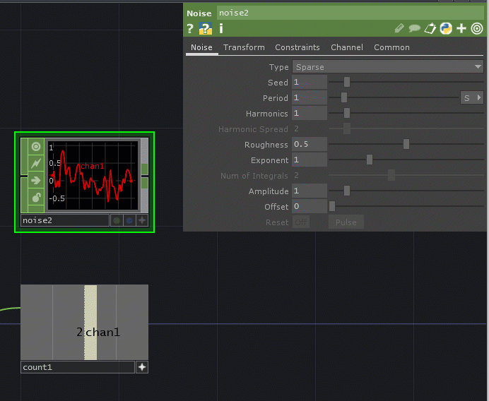

# Overview

TouchDesigner is a program that uses node-based programming and Python scripting.

## Operators (Nodes)

Each operator or node is like a [function](../glossary-and-terms/functions-and-methods/). Many will have input notches, parameters (values within the operator), and an output (similar to a return) that can go into another node.

## Types of Operators

In node-based programming, output data types have to match the input of the next node. In TouchDesigner, instead of multiple output types on one node, operators are separated by their own type:


### **COMP (Components)**

These are operators that handle things like user interface, lighting, etc.

### TOP (Texture Operators)

These operators handle 2D images, animations, and video effects. Think of these like Photoshop and AfterEffects.

### CHOP (Channel Operators)

These operators deal with numbers, booleans (on/off or true/false), and audio. Each value is often displayed as a "channel."


Numbers over time and some arrays of numbers will appear as a line graph. To change this into a value that "slices" through the line graph values, use the Time Slice CHOP or the Time Slice parameter under the Common tab.


### SOP (Surface Operators)

These operators handle 3D shapes and objects. Think of these like Maya, Blender, etc.

### MAT (Materials)

These operators handle materials, textures, and shaders.

### DAT (Data)

These operators handle Python and other types of scripting as well as tables.

## Inputs

Input notches are on the **left side** of the operators.

_Example of an operator that has one input:_


_Example of an operator that has three outputs:_


_Example of an operator that takes in multiple inputs to create a list or something like an array:_


_Example of an operator that has no inputs:_


### How to see what input is wanted

Hover your mouse over the input notch - a description will come up with the input number and description.

Examples:


Here, the operator is looking for a connected operator to provide an audio/video source as an input.


Here, the operator is looking for an operator with at least one channel connected to the first input to see if changes warrant a count change.


Here, the operator is looking for an operator connected to the second input that will fire "true" when the count should reset, if wanted.


Here, the operator is looking for an operator connected to the third input that will provide the increment value if different than the default. Note: this value can be negative!

## Parameters

Each operator will have a related parameters window appear when the operator is selected.


If you do not see the Parameters window, this can be toggled on and off with the **P** key.


Example of a Parameters window:


Things to notice:

On the top left, the **type of operator** is shown (Movie File In).

Followed by the **name of the operator** that you can update. This will update the name that appears at the bottom of the operator node. (`moviefilein1`)

The next line has** icons for help** on the left and **advanced features** like tags, comments, language, and views on the right.

To save space, most Parameter windows will have **tabs** - here, they are Play, Image, Trim, Tune, and Common. These will change depending on the operator.

The rest are parameters - like in a function - that are values that change how something in a node looks, sounds, acts, etc.

### Common Parameters

For TOPs (purple texture operators), the **Common** tab is where you can update the resolution and aspect of the output image. It usually defaults to "Use Input," but can be changed. Free versions are limited, though.


For CHOPs (green channel operators), the **Common** tab is where you can change how a node appears (line graph vs. moving bar graph, called a "Time Slice").


### Referencing Other Operators in Parameters

There are times when you want a value from an operator that isn't connected into the input. You can reference it instead!

There are two ways to do this.

First, expand the parameter you want to have the value in by pressing the plus sign that appears next to it when you hover over the name of the parameter:

.png>)


This will show the variable name of the parameter. 

The colored squares next to the value mean:

**Gray **- Value typed in

**Cyan** - An "expression" using Python to reference an operator or variable like `absTime.seconds`

**Green** - An exported value (references through file organization)

**Lavender** - Bind....this is new, so I have no idea.

We will use the Cyan expression option, so click on the cyan square.


It defaults to whatever the current type value was.

The syntaxes to reference operator values is:

```python
op('operatorname')['channelname']
```

or

```python
op('operatorname')[index]
```

or (for parameter values)

```python
op('operatorname').par.parametername
```

In this example, I want this count CHOP value to be the seed value of my noise CHOP.


So here are my options:

#### Option 1: Typing in an expression


or


Let's say instead of this output value, I want the Reset Value parameter of the count CHOP instead:


I could use the following expression:


#### Option 2: Click and Drag Output Values

Toggle the Viewer Active option on the bottom right of the channel operator.


This will fill the operator with the output value.


Select your target operator to bring up its parameters.

Click and drag from your source operator to the field for your target parameter and choose **CHOP Reference**.



## Output

The output notch is on the right side of the operator.
