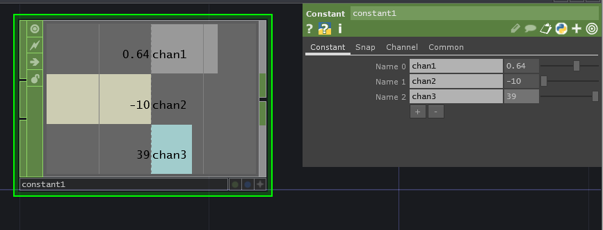
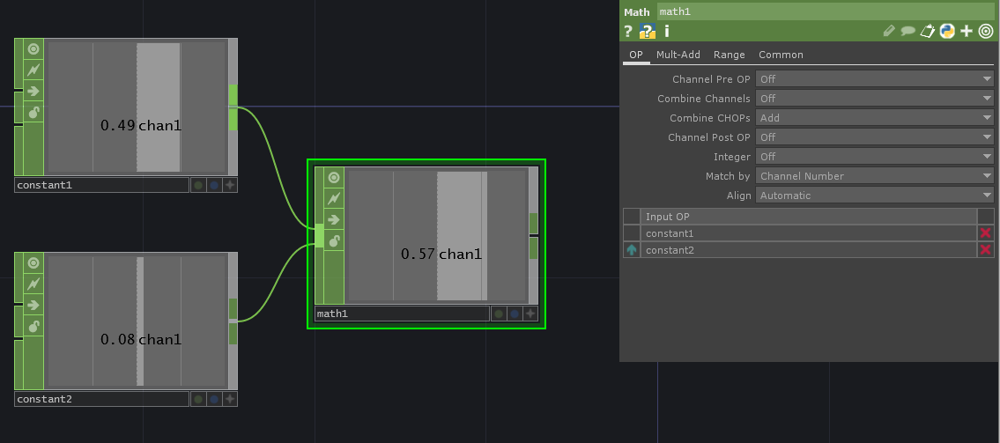
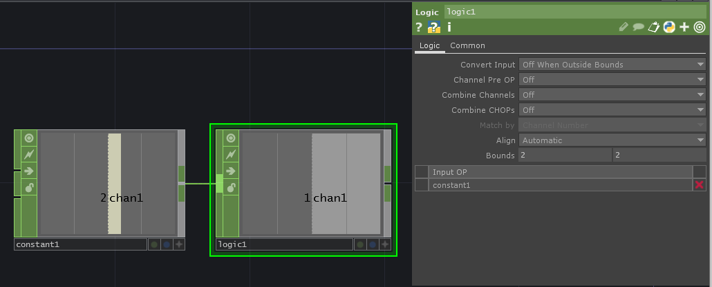

# Popular CHOPs

Channel operators \(CHOPs\) are colored green and manipulate number data, booleans \(on/off or true/false\), and audio.

## Basics

### Null CHOP

Provides a snapshot of sorts of a point within your network. Commonly used to help look at the effects of major changes later and remove them easily when necessary.

### Constant CHOP

Provides a number, usually typed in. You can have multiple channels/numbers. The slider makes values 0-1 easy to get, but you can type in larger numbers and negative numbers.

### Noise CHOP

For when you want some randomness.

To see it moving in real-time, use the **Common &gt; Time Slice** parameter.

### Switch CHOP

Takes in multiple channel operators \(CHOPS\) and creates an array. A single element of the array can be accessed by the Switch CHOP's Index parameter.

### Select CHOP

Provides a "copy" that displays selected channels from the original channel operator.

Click and drag the original CHOP onto the Select CHOP or type the original CHOP's name into the Select CHOP's CHOP parameter.

Click the dropdown arrow to the right of the Channels parameter to select \(one-by-one\) one or more channels.


When wanting all possible channels, use an asterisk `*` ... This can be also used to get all possible channels that start with a certain letter or phrase.


## Math

### Math CHOP

Does math including absolute powers, turning numbers, negative, etc.

_Example of adding two CHOPs:_

_Example of subtracting two channels from the same CHOP:_

_Example of making a number negative:_

_Example of rounding up to the next integer:_

_Example of getting a square root of a number:_

### Using Math CHOP to adjust range/map values

The top way you'll use a Math CHOP is to adjust the range of values. Many operators expect a value from 0 to 1, so finding what the upper and lower bounds of a number are allows the Math CHOP to adjust it to fit.

_Example of having the 0-255 RGB values, but need a 0-1 RGB value for a Constant TOP:_

## Logic

### Logic CHOP

Will turn on/fire true under certain circumstances - kinda like an if statement or while loop.

_Example of the Logic CHOP being true when the input is 2:_

### Count CHOP

Counts the times the input is true or on.

_Example of counting the times the timer is "done":_


This GIF is at 30 fps and doesn't show each time it's done, but you can see it in the program.


## Timers

### Timer CHOP

Provides a timer and whether it is "ready" or "done."

## Audio

### Audio Device In CHOP

Brings in audio from microphones.

### Audio Device Out CHOP

Plays audio through your speakers and headphones.

### Audio File In CHOP

Gets audio from an audio OR video file.

### Audio File Out CHOP

Exports an audio file.

