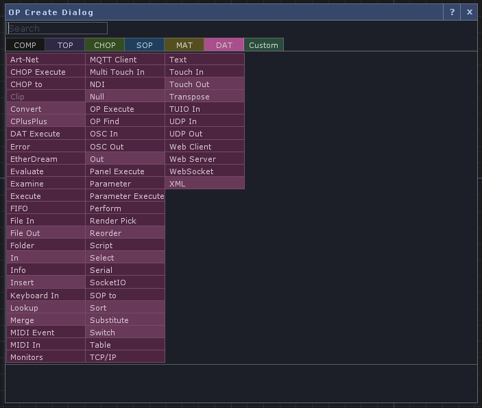
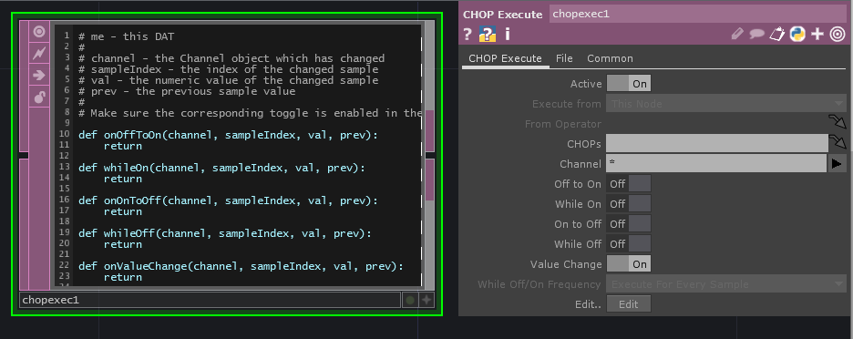
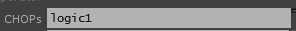

# Popular DATs

Data operators (DATs) are colored magenta and allow for Python scripting to run.

## Run a Python Script

### CHOP Execute DAT

My favorite DAT - will run a Python script when (all optional):

* Something is true or on
* Something remains true or on
* Something is false or off
* Something remains false or off
* A value changes

Right-click on the operator and choose Edit Contents in Textport to edit the pre-made script.

Make sure the appropriate thing is checked in the parameters and your code is in the proper function.

Update the CHOPs field to tell the DAT which CHOPs to track. You can click and drag the whole CHOP to the DAT to do this.

