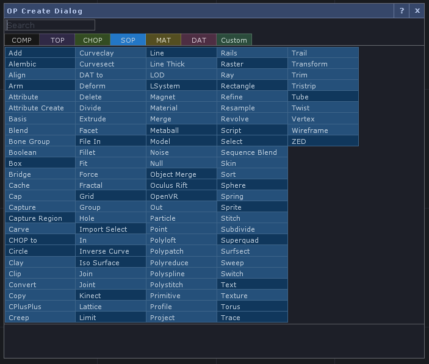
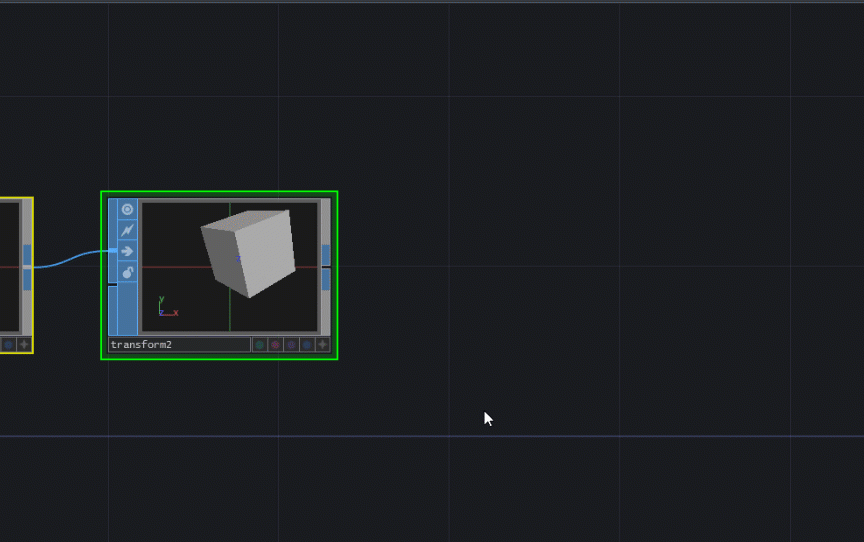
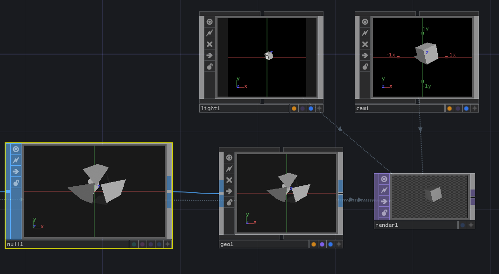
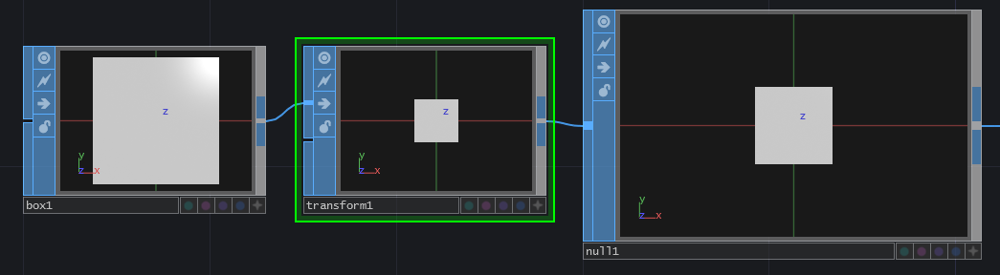
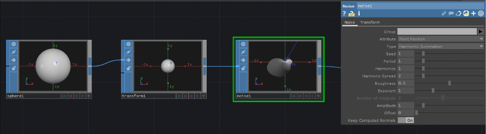
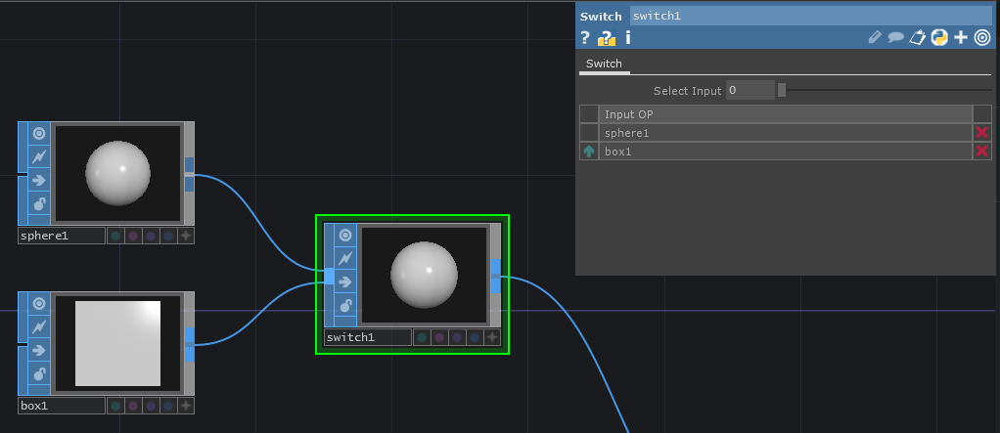
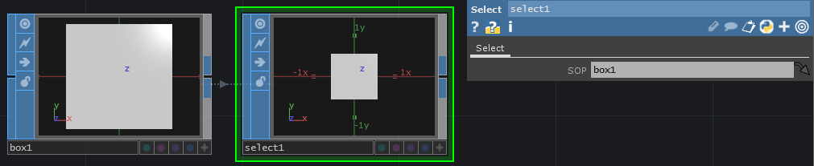
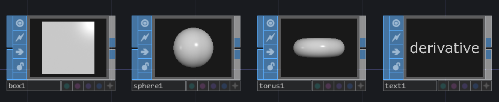
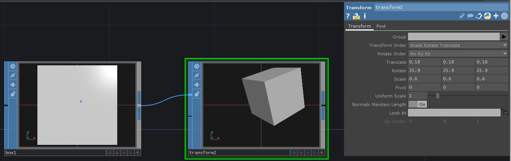

# Popular SOPs

Surface operators \(SOPs\) are colored blue and manipulate 3D objects.

## Extra for 3D

For 3D scenes, you'll need the following:

* Light COMP
* Camera COMP
* Geometry COMP \(see below how to do this with pre-existing 3D objects\)
* Render Top

Adding each will set them up without adding more connections.

### Make a Geometry COMP from your SOP

How it should look when everything is added:

## Basics

### Null SOP

Provides a snapshot of sorts of a point within your network. Commonly used to help look at the effects of major changes later and remove them easily when necessary.

### Noise SOP

For when you want some randomness.

### Switch SOP

Takes in multiple surface operators \(SOPS\) and creates an array. A single element of the array can be accessed by the Switch SOP's Index parameter.

### Select SOP

Provides a visual "copy" that references another surface operator. This is great for large projects where you are referencing SOPs in other areas far from the one you need it for.

Click and drag the original SOP into the Select SOP or type in the original SOP's name in the Select SOP's parameter.

## Shapes / Primitives / Transforms

### Box SOP, Sphere SOP, Torus SOP, Text SOP

Creates 3D shapes or text.

### Transform SOP

Manipulates position, rotation, scale, etc.

