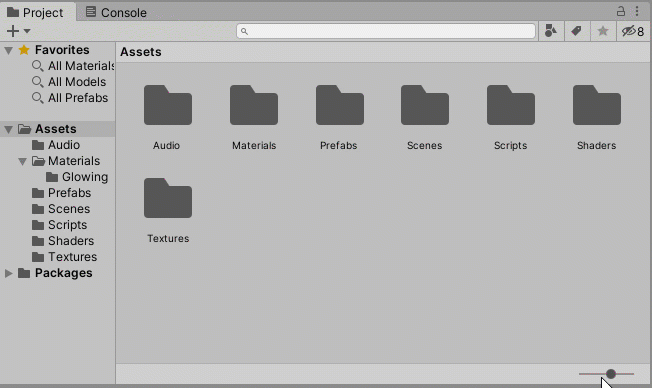

# Project Window

This window shows the folders in the Asset folder of your project file and is where all of your assets \(materials, scripts, sounds, prefabs, etc.\) can be accessed.

Assets are the files used like an artist's materials - they can be used multiple times on many game objects. The game objects are listed in the [Hierarchy ](hierarchy-window.md)window.

## Default View

**Note:** This is in a shortened window.

## File Organization

All assets seen in this window are located \(along with data files\) in the project's Asset folder. When you create folders here, they will also be created in that Asset folder. Clicking and dragging files \(textures, 3D models, audio, etc.\) into the Project Tab _creates a copy_ of the files in the Asset folder.

Although all the assets are stored within the project, organized folders are recommended. Here's an example of a folder structure for a project:

This makes it easier to find and create types of assets. This is just one way to organize assets - find what works for you!

**Notes:**  
1. You can usually move assets from one folder to another. Scripts are the only files that might need to be updated within items and scripts after moving.  
2. When you drag a texture onto an object, a material is auto-created and put into an auto-created folder named "Materials" within the same folder as the texture.

## Left Side

**Create Asset** - Click the plus sign or + to add an asset to the Asset folder.

**Favorite Searches** - By default, you can use the searches under "Favorites" to see just Materials, Models, or Prefabs.

**Assets Folder Structure** - The folders and subfolders can easily be accessed here. Click on the arrow on the left of a folder name to see the subfolders.

## **Breadcrumbs and File Paths**

Larger projects could have many subfolders. The "breadcrumb" navigation at the top of the window allows for easy access to higher folders.

**Note:** Unlike Windows Explorer, you cannot drag an asset to a folder in the breadcrumb navigation. You can, however, drag it to the folder in the Assets folder structure on the left.

The file path \(starting with the Assets folder\) is shown at the bottom of the window:

## Search Bar

When you start typing in the search bar, assets with matching names will be listed. You can narrow your search using the filters just below the search bar. Clear your search by clicking the X on the right side of the search bar.

## More Options

**Search by Type** - This menu makes searching for a specific type of asset quick.

**Search by Label** - Multiple labels can be added to an asset in the Inspector window. Use this search to list only the assets with the selected label\(s\).

**Add Favorite Search** - This adds a custom search under Favorites on the left side of the window.

**Toggle Hidden Folders** - The Packages folder's subfolders are hidden by default.

## Zoom

The zoom control on the bottom right will "zoom" in and out of the files, showing large previews down to a list of names.

